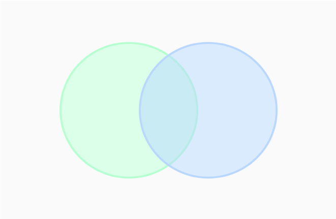
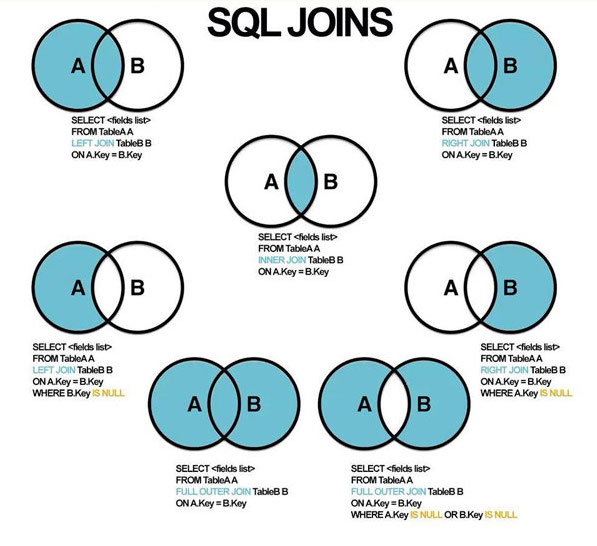
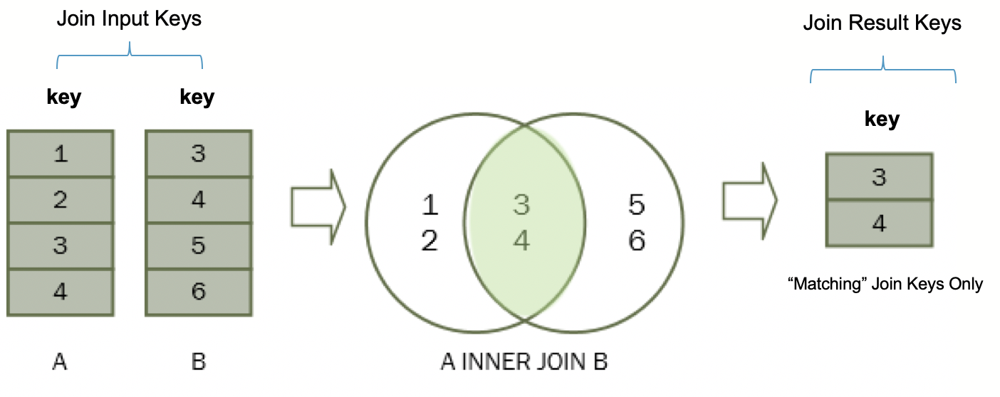
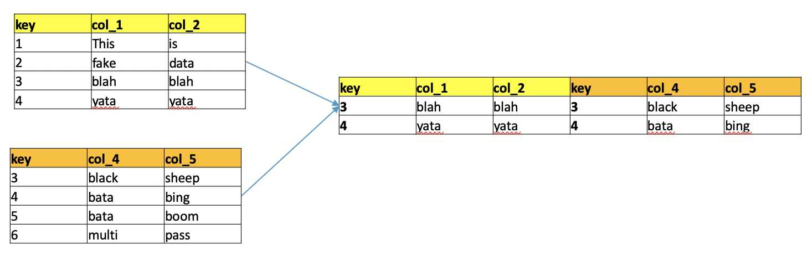
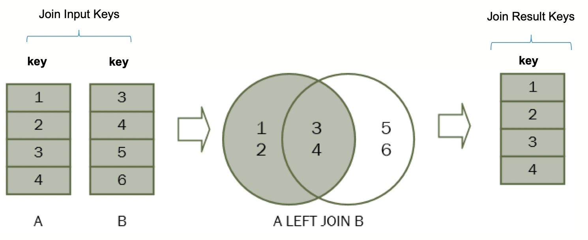
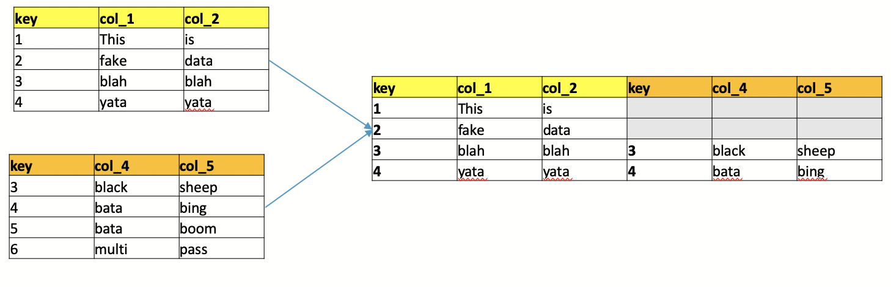
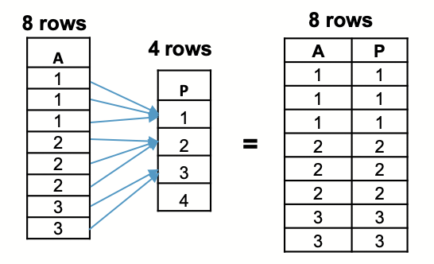
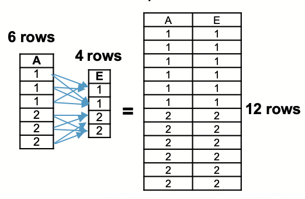

<!--
author:   Peter Camacho, Clinical Reporting Unit, Children's Hospital of Philadelphia
email:    camachop@chop.edu
version:  1.0.0
language: en
narrator: US English Female
comment:  SQL (Structured Query Language) is a domain-specific language used in programming and designed for managing data held in a Relational Database Management System (RDBMS), or for stream processing in a relational data stream management system (RDSMS).
link:     https://chop-dbhi-arcus-education-website-assets.s3.amazonaws.com/css/custom.css
logo:     https://github.com/arcus/education_fellows/raw/main/img/chop-icon.png

script: https://cdn.jsdelivr.net/npm/alasql@0.6.5/dist/alasql.min.js
attribute: [AlaSQL](https://alasql.org)
           by [Andrey Gershun](agershun@gmail.com)
           & [Mathias Rangel Wulff](m@rawu.dk)
           is licensed under [MIT](https://opensource.org/licenses/MIT)

script: https://cdnjs.cloudflare.com/ajax/libs/PapaParse/4.6.1/papaparse.min.js
attribute: [PapaParse](https://www.papaparse.com)
           by [Matthew Holt](https://twitter.com/mholt6)
           is licensed under [MIT](https://opensource.org/licenses/MIT)
           
script: https://cdnjs.cloudflare.com/ajax/libs/jquery/3.6.0/jquery.min.js
attribute: [jQuery](https://jquery.com/)
           is licensed under [OpenJS Foundation](https://openjsf.org/)

@AlaSQL.eval
<script>
//////////////////////////////////////////////////////////////////////////////////////////////////////////////////////////////
// BUILD FUNCTIONS
//////////////////////////////////////////////////////////////////////////////////////////////////////////////////////////////
function buildHtmlTable() {
  // Builds the HTML Table out of myList, and writes output to the id attribute assigned via the "@0" argument to this marco.
  var columns = addAllColumnHeaders(myList);
  for (var i = 0 ; i < myList.length ; i++) {
    var row$ = $('<tr/>');
    for (var colIndex = 0 ; colIndex < columns.length ; colIndex++) {
      var cellValue = myList[i][columns[colIndex]];
      if (cellValue == null) { cellValue = ""; }
      row$.append($('<td/>').html(cellValue));
    }
    $(@0).append(row$);
  }
  try { // Error Handling for no null.
    var rowCount = document.getElementById(@0.substring(1)).rows.length - 1;
  } catch(err) {
    var cnt = 0
  }
  if (rowCount > 0) {
    var complete_message = "Query Execution Complete! (See Result Set Below)..."
  } else {
    var complete_message = "No Data to Return.."
  }
  return JSON.stringify(complete_message, null, 3);
}
function addAllColumnHeaders(myList) {
  // Creates and Returns Header Row From Array Data Provided as Input.
  var columnSet = [];
  var headerTr$ = $('<tr/>');
  for (var i = 0 ; i < myList.length ; i++) {
    var rowHash = myList[i];
    for (var key in rowHash) {
      if ($.inArray(key, columnSet) == -1){
        columnSet.push(key);
        headerTr$.append($('<th/>').html(key));
      }
    }
  }
  $(@0).append(headerTr$);
  return columnSet;
}
//////////////////////////////////////////////////////////////////////////////////////////////////////////////////////////////
// 
//////////////////////////////////////////////////////////////////////////////////////////////////////////////////////////////
try {
    var myinput=`@input`
    myinput=myinput.replace(/;$/, ""); // remove trailing semi-colon
    var myStriptArray= myinput.split(';');
    var arrayLength = myStriptArray.length;
    console.clear();
    for (var i = 0; i < arrayLength; i++) {
        if((myStriptArray[i].trim()).length != 0) { // ignore blank queries.
            var myList=alasql(myStriptArray[i]);
        }
        if (myList != 1  & ((myStriptArray[i].trim()).length) != 0) { // If data is returned, format output as table.
            $(@0).html(""); // clear out existing data
            buildHtmlTable();
        } else {
            $(@0).html(""); // clear out existing data
            JSON.stringify("No Data to Return..", null, 3);
        }
    }
} catch(e) {
  let error = new LiaError(e.message, 1);
  try {
    let log = e.message.match(/.*line (\d):.*\n.*\n.*\n(.*)/);
    error.add_detail(0, e.name+": "+log[2], "error", log[1] -1 , 0);
  } catch(e) {
  }
  throw error;
}
</script>
@end

@AlaSQL.buildTable_patients
<script>
    alasql("DROP TABLE IF EXISTS patients;");
    alasql("create table patients (id text,birthdate date,deathdate date,ssn text,drivers text,passport text,prefix text,first text,last text,suffix text,maiden text,marital text,race text,ethnicity text,sex text,birthplace text,address text,city text,state text,county text,zip integer,lat real,lon real);");
    alasql("INSERT INTO patients VALUES ('bf35e4fa-ea4f-40a4-8fe6-1f2f26e0aa45','2000-11-21',null,'999-87-8860','S99917788',null,'Ms.','Cecila','Feil',null,null,null,'white','nonhispanic','F','Nahant  Massachusetts  US','873 Mueller Arcade Unit 96','Ashland','Massachusetts','Middlesex County',null,42.2138985577807,-71.503695110333);");
    alasql("INSERT INTO patients VALUES ('e3af2463-f4c9-4dbb-a8d2-d6a08c5b1460','2013-07-02',null,'999-82-6451',null,null,null,'Lorrie','Leannon',null,null,null,'white','nonhispanic','F','Winthrop  Massachusetts  US','813 Casper Street','Peabody','Massachusetts','Essex County',1940,42.4951616189433,-71.0071749067398);");
    alasql("INSERT INTO patients VALUES ('e061409e-4b85-4ec1-b1f7-02677d51f763','1997-09-11',null,'999-32-2366','S99995098','X50396137X','Ms.','Tabetha','OHara',null,null,null,'white','nonhispanic','F','Auburn  Massachusetts  US','1080 Sawayn Gateway Suite 9','Framingham','Massachusetts','Middlesex County',1701,42.3224819015944,-71.4003256055831);");
    alasql("INSERT INTO patients VALUES ('71e13815-55fb-4734-bcac-6079160d82a0','1973-06-02',null,'999-94-8759','S99996780','X23275205X','Mrs.','Laticia','Flatley',null,'Rempel203','M','white','nonhispanic','F','Boston  Massachusetts  US','469 Gerhold Bay Unit 34','Waltham','Massachusetts','Middlesex County',2451,42.4312144913848,-71.2680783842969);");
    alasql("INSERT INTO patients VALUES ('ca3330c5-bbbc-47e7-addb-302f2e069986','2003-06-23',null,'999-44-5854','S99912993',null,null,'Golden','Pollich',null,null,null,'white','nonhispanic','F','Carlisle  Massachusetts  US','792 OKon Byway','Springfield','Massachusetts','Hampden County',1105,42.0930726815877,-72.5803988374441);");
    alasql("INSERT INTO patients VALUES ('24bca5cf-ba55-457f-8e80-49690202443c','1977-06-28',null,'999-31-8026','S99975475','X46617643X','Mr.','Lionel','Fadel',null,null,'M','white','nonhispanic','M','Dighton  Massachusetts  US','1015 Parisian Divide Unit 26','Fairhaven','Massachusetts','Bristol County',null,41.6529893063487,-70.8948756027136);");
    alasql("INSERT INTO patients VALUES ('841095eb-d29f-4492-8f0e-08011321e85d','2017-04-08',null,'999-81-1909',null,null,null,'Carlton','Leffler',null,null,null,'asian','nonhispanic','M','Ipswich  Massachusetts  US','344 Feest Camp Suite 73','Wakefield','Massachusetts','Middlesex County',1880,42.4780284069299,-71.0892699664186);");
    alasql("INSERT INTO patients VALUES ('ee7f6c74-a8ed-4147-b8e2-4879c8657b0f','1950-04-11',null,'999-24-8407','S99984370','X70737069X','Mr.','Kelvin','Powlowski',null,null,'M','white','nonhispanic','M','Fall River  Massachusetts  US','623 Runolfsson Annex Suite 88','Revere','Massachusetts','Suffolk County',2151,42.4674386785624,-71.0070987954362);");
    alasql("INSERT INTO patients VALUES ('ab6a2662-f6d1-4da6-b3ce-3929d68650d7','1971-01-16',null,'999-76-3317','S99978505','X28929072X','Mrs.','Miesha','Wyman',null,'Jacobs452','M','white','nonhispanic','F','Harvard  Massachusetts  US','850 Thiel Road Unit 0','Westfield','Massachusetts','Hampden County',1086,42.0904434489837,-72.7927566478986);");
    alasql("INSERT INTO patients VALUES ('4440ff11-69ec-440b-a2bd-dc1c14105e8e','2001-11-20',null,'999-68-1710','S99968894',null,'Ms.','Ona','Dooley',null,null,null,'white','hispanic','F','Athol  Massachusetts  US','1048 Weimann Throughway','Northborough','Massachusetts','Worcester County',null,42.3661545339449,-71.6515505734496);");
    alasql("INSERT INTO patients VALUES ('1aa71b23-790e-4d22-92da-c689682c8993','1993-05-03',null,'999-84-7590','S99922416','X45217366X','Ms.','Jeannie','VonRueden',null,null,null,'white','nonhispanic','F','Ashburnham  Massachusetts  US','711 Williamson Dale','Ayer','Massachusetts','Middlesex County',null,42.5198988512541,-71.6009012317879);");
    alasql("INSERT INTO patients VALUES ('848e0227-5d5d-4bdf-8603-207cdea72e2a','1949-03-27',null,'999-87-5716','S99971093','X51980015X','Mrs.','Alda','Kris',null,'Satterfield305','M','white','nonhispanic','F','Mansfield  Massachusetts  US','1090 Wiegand Union','Attleboro','Massachusetts','Bristol County',null,41.9326094578451,-71.3272454816091);");
    alasql("INSERT INTO patients VALUES ('eafd1fd3-3778-423a-ba79-4584bd310eb4','2003-07-05',null,'999-39-2345','S99942603',null,null,'Buford','Lynch',null,null,null,'white','nonhispanic','M','Walpole  Massachusetts  US','332 Witting Mission','Malden','Massachusetts','Middlesex County',null,42.4569197038897,-71.0641138577902);");
    alasql("INSERT INTO patients VALUES ('0288abb6-633c-40c3-ba0c-66c7d957727e','1950-11-28',null,'999-18-7195','S99953954','X15598453X','Mrs.','Keva','Shanahan',null,'Reichel38','M','white','nonhispanic','F','Winchendon  Massachusetts  US','169 Witting Orchard Unit 98','Williamstown','Massachusetts','Berkshire County',null,42.7353013466036,-73.1923384461437);");
    alasql("INSERT INTO patients VALUES ('097079b1-ff8f-4ee0-8ce3-0ea744ecfa21','2003-06-18',null,'999-43-8940','S99945945',null,null,'Maribeth','DAmore',null,null,null,'white','hispanic','F','Fall River  Massachusetts  US','238 Mills Hollow','Holyoke','Massachusetts','Hampden County',1040,42.1738356843755,-72.6457553208547);");
    alasql("INSERT INTO patients VALUES ('78a9a8d6-b3b2-47dc-b4a0-867abec7c78f','1993-05-01',null,'999-75-7372','S99974220','X59022582X','Mr.','James','Wyman',null,null,null,'white','nonhispanic','M','Stoughton  Massachusetts  US','702 Stoltenberg Course Apt 16','Attleboro','Massachusetts','Bristol County',2703,41.9406317547512,-71.311136544988);");
    alasql("INSERT INTO patients VALUES ('c05478a7-a4df-4fd3-8d68-60b9452d4781','2010-10-14',null,'999-96-3194',null,null,null,'Brandon','Hagenes',null,null,null,'white','nonhispanic','M','Natick  Massachusetts  US','519 Thiel Annex Apt 55','Pittsfield','Massachusetts','Berkshire County',null,42.4079671056193,-73.3177862656724);");
    alasql("INSERT INTO patients VALUES ('e188fafe-c1bb-45dc-9627-4ff4e4bc0ec0','2008-07-16',null,'999-93-5743',null,null,null,'Frances','Schumm',null,null,null,'white','nonhispanic','M','Chelsea  Massachusetts  US','826 Hammes Mission Apt 1','Natick','Massachusetts','Middlesex County',null,42.2584672080661,-71.3444415391516);");
    alasql("INSERT INTO patients VALUES ('8db0d104-4c3f-40d3-bcf5-f5eb81b7308f','2002-03-02',null,'999-93-1045','S99931036',null,'Ms.','Essie','Kutch',null,null,null,'white','nonhispanic','F','Cambridge  Massachusetts  US','219 Gorczany Gateway Unit 71','Chelmsford','Massachusetts','Middlesex County',null,42.5642627698721,-71.3448142130082);");
    alasql("INSERT INTO patients VALUES ('df7c1d66-eac2-49bd-9d12-ee17e8758f68','1979-11-19',null,'999-19-4886','S99963281','X82905419X','Mrs.','Iraida','Oberbrunner',null,'Sporer811','M','white','nonhispanic','F','Hanson  Massachusetts  US','903 Spencer Gate Suite 97','Springfield','Massachusetts','Hampden County',null,42.018977154431,-72.5783835627201);");
    alasql("INSERT INTO patients VALUES ('68878f91-5962-4ef2-83e7-43b8298c1708','1977-11-07',null,'999-40-6743','S99988503','X59484000X','Mr.','Ali','Maggio',null,null,'S','asian','nonhispanic','M','Taunton  Massachusetts  US','448 Rath Glen','Boston','Massachusetts','Suffolk County',2118,42.3425177110989,-71.1548454376564);");
    alasql("INSERT INTO patients VALUES ('1c2aa038-9366-4c7d-9a3e-52cb753a670f','1962-09-13',null,'999-19-8817','S99966954','X83180931X','Mr.','Homero','Carrillo',null,null,'M','white','hispanic','M','Gaudalajara  Jalisco  MX','627 Weissnat Fork','Boston','Massachusetts','Suffolk County',2128,42.3109346386431,-71.0700902117231);");
    alasql("INSERT INTO patients VALUES ('8d202c65-427d-4190-8c28-3aa27e1a9f4c','1986-10-24',null,'999-82-4546','S99932840','X66208297X','Mrs.','Mariam','Bogisich',null,'Hermann103','M','white','nonhispanic','F','Milton  Massachusetts  US','1032 McClure Extension Unit 88','Framingham','Massachusetts','Middlesex County',1701,42.3029088307893,-71.4025310847364);");
    alasql("INSERT INTO patients VALUES ('2a6d1e58-88eb-4be0-b6b4-59a471257c2e','1964-10-10',null,'999-22-8704','S99976805','X66668021X','Ms.','Nikia','Herzog',null,null,'S','white','nonhispanic','F','Wareham  Massachusetts  US','679 Robel Junction Apt 36','Quincy','Massachusetts','Norfolk County',2169,42.2640821758816,-71.0518467413496);");
    alasql("INSERT INTO patients VALUES ('e6ff4bf9-09c2-4976-aa84-cca142207cf8','1998-12-23',null,'999-91-5603','S99952608','X23816401X','Ms.','Corie','Howe',null,null,null,'white','nonhispanic','F','West Boylston  Massachusetts  US','580 Hickle Dam','Brookline','Massachusetts','Norfolk County',2215,42.3312937592791,-71.1672225619312);");
    JSON.stringify(@0);
</script>
@end

@AlaSQL.buildTable_encounters
<script>
    alasql("DROP TABLE IF EXISTS encounters;");
    alasql("create table encounters (id text,start date,stop date,patient text,organization text,provider text,encounterclass text,description text,reasondescription text);");
    alasql("INSERT INTO encounters VALUES ('a61f97fa-70c3-4366-90e1-7c6fdcba5cbb','2002-01-24T20:46:46Z','2002-01-24T21:31:46Z','bf35e4fa-ea4f-40a4-8fe6-1f2f26e0aa45','24cb4eab-6166-3530-bddc-a5a8a14a4fc1','7bd4e666-a82d-3ad1-bc7c-b49eb726577b','ambulatory','Encounter for problem',null);");
    alasql("INSERT INTO encounters VALUES ('469fbd8a-ec48-4da9-9165-027144ccf9a0','2014-12-04T23:28:40Z','2014-12-05T00:08:40Z','e3af2463-f4c9-4dbb-a8d2-d6a08c5b1460','d692e283-0833-3201-8e55-4f868a9c0736','f4eb93d1-9187-3cfb-83a4-6d9cd77f7df6','ambulatory','Encounter for problem',null);");
    alasql("INSERT INTO encounters VALUES ('022ad487-e41c-43ba-90f3-eb2d6711f4d3','1998-07-19T12:55:35Z','1998-07-19T13:38:35Z','e061409e-4b85-4ec1-b1f7-02677d51f763','465de31f-3098-365c-af70-48a071e1f5aa','0a8a9359-7b33-3256-a068-b5a7d18ebe4b','ambulatory','Encounter for problem',null);");
    alasql("INSERT INTO encounters VALUES ('9607667e-4c98-4087-9c59-0fd5b6331078','1974-05-17T10:52:30Z','1974-05-17T11:07:30Z','71e13815-55fb-4734-bcac-6079160d82a0','6f122869-a856-3d65-8db9-099bf4f5bbb8','3180b739-e823-37a0-b307-52a6d67db4a5','ambulatory','Encounter for problem',null);");
    alasql("INSERT INTO encounters VALUES ('d8f2b92b-5971-455f-a0b9-99da66d03899','2004-07-03T22:12:27Z','2004-07-03T22:57:27Z','ca3330c5-bbbc-47e7-addb-302f2e069986','60457c13-adb2-3415-82c5-86ab5dab5f93','47cb5349-d261-324a-9109-c888f4a0e966','ambulatory','Encounter for problem',null);");
    alasql("INSERT INTO encounters VALUES ('1d475126-f3c0-41c9-a9ed-f4a0c9a955c4','1978-11-04T06:05:02Z','1978-11-04T06:51:02Z','24bca5cf-ba55-457f-8e80-49690202443c','ef6ab57c-ed94-3dbe-9861-812d515918b3','77a7881d-6dd5-32e1-9e18-521a59749572','ambulatory','Encounter for problem',null);");
    alasql("INSERT INTO encounters VALUES ('32622f63-734e-4433-8628-942ce1585e6a','2018-03-20T11:48:11Z','2018-03-20T12:36:11Z','841095eb-d29f-4492-8f0e-08011321e85d','d692e283-0833-3201-8e55-4f868a9c0736','f4eb93d1-9187-3cfb-83a4-6d9cd77f7df6','ambulatory','Encounter for problem',null);");
    alasql("INSERT INTO encounters VALUES ('0b7d2e65-a9df-4b74-84ed-25feffc23f62','1951-04-21T08:40:57Z','1951-04-21T08:55:57Z','ee7f6c74-a8ed-4147-b8e2-4879c8657b0f','d692e283-0833-3201-8e55-4f868a9c0736','f4eb93d1-9187-3cfb-83a4-6d9cd77f7df6','ambulatory','Encounter for problem',null);");
    alasql("INSERT INTO encounters VALUES ('603a0692-9302-459a-84b4-af631dc3aee8','1971-03-07T16:13:43Z','1971-03-07T16:28:43Z','ab6a2662-f6d1-4da6-b3ce-3929d68650d7','ebc3f5c4-6700-34af-8323-85621c313726','eabb2bff-3216-34da-9f29-824dbca901c3','ambulatory','Encounter for problem',null);");
    alasql("INSERT INTO encounters VALUES ('38de2a79-6bea-438e-963f-804823c1e32d','2002-05-31T06:08:11Z','2002-05-31T07:01:11Z','4440ff11-69ec-440b-a2bd-dc1c14105e8e','331f4c11-d298-308b-aaa1-d7825b29b57f','8ee28b4a-9018-3065-9f6b-0c9b69de7080','ambulatory','Encounter for problem',null);");
    alasql("INSERT INTO encounters VALUES ('228c992b-3877-454c-920d-fa629bb8c5d9','1994-05-12T20:03:59Z','1994-05-12T20:47:59Z','1aa71b23-790e-4d22-92da-c689682c8993','ac8356a5-78f8-3a63-8a1e-59e832fd54e7','f6065151-bf86-330b-a526-ac86b53b440b','ambulatory','Encounter for problem',null);");
    alasql("INSERT INTO encounters VALUES ('77427b07-f03b-49bc-9556-d69b4feed7ef','1950-01-07T13:40:23Z','1950-01-07T13:55:23Z','848e0227-5d5d-4bdf-8603-207cdea72e2a','5e765f2b-e908-3888-9fc7-df2cb87beb58','0359f968-d1a6-30eb-b1cc-e6cc0b4d3513','ambulatory','Encounter for problem',null);");
    alasql("INSERT INTO encounters VALUES ('36279aee-15ff-48ad-a4a6-8ba334466278','2004-12-06T09:48:16Z','2004-12-06T10:36:16Z','eafd1fd3-3778-423a-ba79-4584bd310eb4','d692e283-0833-3201-8e55-4f868a9c0736','f4eb93d1-9187-3cfb-83a4-6d9cd77f7df6','ambulatory','Encounter for problem',null);");
    alasql("INSERT INTO encounters VALUES ('a64c55df-b288-4f78-9996-d2ecf0b65c9d','1952-03-11T04:07:36Z','1952-03-11T04:22:36Z','0288abb6-633c-40c3-ba0c-66c7d957727e','4f3a530e-a2f7-3de0-9a09-c0a70a9ab894','3f15c687-0cfe-3bf2-9e62-34f3c85ff3cb','ambulatory','Encounter for problem',null);");
    alasql("INSERT INTO encounters VALUES ('9c3c633f-c33c-426c-b771-b6117ba7d6fc','2004-04-26T14:03:38Z','2004-04-26T14:42:38Z','097079b1-ff8f-4ee0-8ce3-0ea744ecfa21','5d4b9df1-93ae-3bc9-b680-03249990e558','af01a385-31d3-3c77-8fdb-2867fe88df2f','ambulatory','Encounter for problem',null);");
    alasql("INSERT INTO encounters VALUES ('7c0482a4-04fc-4cdc-9c2b-ff1f28f704db','1994-06-07T13:13:50Z','1994-06-07T13:57:50Z','78a9a8d6-b3b2-47dc-b4a0-867abec7c78f','5e765f2b-e908-3888-9fc7-df2cb87beb58','0359f968-d1a6-30eb-b1cc-e6cc0b4d3513','ambulatory','Encounter for problem',null);");
    alasql("INSERT INTO encounters VALUES ('6dbce8d2-3bb0-4ff9-8e9b-7152ff03cc0c','2011-10-24T09:24:08Z','2011-10-24T10:01:08Z','c05478a7-a4df-4fd3-8d68-60b9452d4781','4f3a530e-a2f7-3de0-9a09-c0a70a9ab894','3f15c687-0cfe-3bf2-9e62-34f3c85ff3cb','ambulatory','Encounter for problem',null);");
    alasql("INSERT INTO encounters VALUES ('5e4a49f2-47e7-4b76-9120-276a79f1766f','2009-01-22T22:23:00Z','2009-01-22T23:15:00Z','e188fafe-c1bb-45dc-9627-4ff4e4bc0ec0','465de31f-3098-365c-af70-48a071e1f5aa','0a8a9359-7b33-3256-a068-b5a7d18ebe4b','ambulatory','Encounter for problem',null);");
    alasql("INSERT INTO encounters VALUES ('e75460f0-5f5c-4aa2-ab0b-200310a96c63','2003-06-13T09:58:22Z','2003-06-13T10:35:22Z','8db0d104-4c3f-40d3-bcf5-f5eb81b7308f','b0e04623-b02c-3f8b-92ea-943fc4db60da','58b66cc1-2b86-377f-ad77-ad8164388e50','ambulatory','Encounter for problem',null);");
    alasql("INSERT INTO encounters VALUES ('a232db22-565f-4559-bb56-edf9021b74b2','1981-01-29T12:47:12Z','1981-01-29T13:33:12Z','df7c1d66-eac2-49bd-9d12-ee17e8758f68','fd328395-ab1d-35c6-a2d0-d05a9a79cf11','1530e81b-106c-32d5-95d5-42a710c92068','ambulatory','Encounter for problem',null);");
    alasql("INSERT INTO encounters VALUES ('95099931-0042-4524-b808-dd6b6447fc0e','1978-07-20T13:40:53Z','1978-07-20T14:17:53Z','68878f91-5962-4ef2-83e7-43b8298c1708','69176529-fd1f-3b3f-abce-a0a3626769eb','c9b3c857-2e24-320c-a79a-87b8a60de63c','ambulatory','Encounter for problem',null);");
    alasql("INSERT INTO encounters VALUES ('c90b2536-b388-479c-aa7e-3406fe4c2211','1963-07-23T15:56:00Z','1963-07-23T16:11:00Z','1c2aa038-9366-4c7d-9a3e-52cb753a670f','ff9863d3-3fa3-3861-900e-f00148f5d9c2','e49edc61-6ba6-324c-bef7-b65f0e10799f','ambulatory','Encounter for problem',null);");
    alasql("INSERT INTO encounters VALUES ('16bc6376-a1cc-4d63-8307-c5d7479dc021','1987-11-30T13:51:47Z','1987-11-30T14:41:47Z','8d202c65-427d-4190-8c28-3aa27e1a9f4c','465de31f-3098-365c-af70-48a071e1f5aa','0a8a9359-7b33-3256-a068-b5a7d18ebe4b','ambulatory','Encounter for problem',null);");
    alasql("INSERT INTO encounters VALUES ('f7ff5032-50cc-480e-90ca-848c85d6d014','1965-09-23T13:40:01Z','1965-09-23T13:55:01Z','2a6d1e58-88eb-4be0-b6b4-59a471257c2e','12c9daf5-a29c-36c9-ac55-28972463e566','aa89beb2-7bc6-35fa-83f7-4b32039e84eb','ambulatory','Encounter for problem',null);");
    alasql("INSERT INTO encounters VALUES ('6c760807-a6b7-4af4-8d50-f32325803448','2000-01-03T07:32:25Z','2000-01-03T08:22:25Z','e6ff4bf9-09c2-4976-aa84-cca142207cf8','3d10019f-c88e-3de5-9916-6107b9c0263d','4b04cd2f-3f27-35bc-8069-f4ca6339529f','ambulatory','Encounter for problem',null);");
    JSON.stringify(@0);
</script>
@end

@AlaSQL.buildTable_providers
<script>
    alasql("DROP TABLE IF EXISTS providers;");
    alasql("create table providers (id text,name text,gender text,speciality text,address text,city text,state text,zip text,lat real,lon real);");
    alasql("INSERT INTO providers VALUES ('7bd4e666-a82d-3ad1-bc7c-b49eb726577b','Lonna Dietrich','F','GENERAL PRACTICE','14 PROSPECT STREET','MILFORD','MA','01757',42.158692,-71.521419);");
    alasql("INSERT INTO providers VALUES ('f4eb93d1-9187-3cfb-83a4-6d9cd77f7df6','Vern Powlowski','M','GENERAL PRACTICE','585 LEBANON STREET','MELROSE','MA','02176',42.455723,-71.059019);");
    alasql("INSERT INTO providers VALUES ('0a8a9359-7b33-3256-a068-b5a7d18ebe4b','Keri Schmidt','F','GENERAL PRACTICE','115 LINCOLN STREET','FRAMINGHAM','MA','01701',42.307905,-71.436196);");
    alasql("INSERT INTO providers VALUES ('3180b739-e823-37a0-b307-52a6d67db4a5','Zana Considine','F','GENERAL PRACTICE','41 & 45 MALL ROAD','BURLINGTON','MA','01803',42.503227,-71.201713);");
    alasql("INSERT INTO providers VALUES ('47cb5349-d261-324a-9109-c888f4a0e966','Mohammed Parisian','M','GENERAL PRACTICE','759 CHESTNUT STREET','SPRINGFIELD','MA','01199',42.115454,-72.539978);");
    alasql("INSERT INTO providers VALUES ('77a7881d-6dd5-32e1-9e18-521a59749572','Phillip McCullough','M','GENERAL PRACTICE','88 LEWIS BAY ROAD','HYANNIS','MA','02601',41.748854,-70.740536);");
    alasql("INSERT INTO providers VALUES ('eabb2bff-3216-34da-9f29-824dbca901c3','Oscar Mateo','M','GENERAL PRACTICE','115 WEST SILVER STREET','WESTFIELD','MA','01085',42.138838,-72.755911);");
    alasql("INSERT INTO providers VALUES ('8ee28b4a-9018-3065-9f6b-0c9b69de7080','Malinda Cassin','F','GENERAL PRACTICE','201 HIGHLAND STREET','CLINTON','MA','01510',42.411887,-71.690005);");
    alasql("INSERT INTO providers VALUES ('f6065151-bf86-330b-a526-ac86b53b440b','Tressa Kovacek','F','GENERAL PRACTICE','200 GROTON ROAD','AYER','MA','01432',42.562221,-71.584844);");
    alasql("INSERT INTO providers VALUES ('0359f968-d1a6-30eb-b1cc-e6cc0b4d3513','Gaynell Streich','F','GENERAL PRACTICE','211 PARK STREET','ATTLEBORO','MA','02703',41.931653,-71.294503);");
    alasql("INSERT INTO providers VALUES ('3f15c687-0cfe-3bf2-9e62-34f3c85ff3cb','Jesús Quiroz','M','GENERAL PRACTICE','725 NORTH STREET','PITTSFIELD','MA','01201',42.452045,-73.26054);");
    alasql("INSERT INTO providers VALUES ('af01a385-31d3-3c77-8fdb-2867fe88df2f','Garth Wyman','M','GENERAL PRACTICE','575 BEECH STREET','HOLYOKE','MA','01040',42.211656,-72.642448);");
    alasql("INSERT INTO providers VALUES ('58b66cc1-2b86-377f-ad77-ad8164388e50','Veda Pfeffer','F','GENERAL PRACTICE','295 VARNUM AVENUE','LOWELL','MA','01854',42.638893,-71.322107);");
    alasql("INSERT INTO providers VALUES ('1530e81b-106c-32d5-95d5-42a710c92068','Wayne Mertz','M','GENERAL PRACTICE','271 CAREW STREET','SPRINGFIELD','MA','01104',42.115454,-72.539978);");
    alasql("INSERT INTO providers VALUES ('c9b3c857-2e24-320c-a79a-87b8a60de63c','Suzette Monahan','F','GENERAL PRACTICE','330 MOUNT AUBURN STREET','CAMBRIDGE','MA','02138',42.375967,-71.118275);");
    alasql("INSERT INTO providers VALUES ('e49edc61-6ba6-324c-bef7-b65f0e10799f','Carolyne Howell','F','GENERAL PRACTICE','51 BLOSSOM STREET','BOSTON','MA','02114',42.33196,-71.020173);");
    alasql("INSERT INTO providers VALUES ('aa89beb2-7bc6-35fa-83f7-4b32039e84eb','Sanford Gottlieb','M','GENERAL PRACTICE','199 REEDSDALE ROAD','MILTON','MA','02186',42.241589,-71.082651);");
    alasql("INSERT INTO providers VALUES ('4b04cd2f-3f27-35bc-8069-f4ca6339529f','Maile Frami','F','GENERAL PRACTICE','2014 WASHINGTON STREET','NEWTON','MA','02462',42.331876,-71.208402);");
    JSON.stringify(@0);
</script>

@AlaSQL.buildTable_organizations
<script>
    alasql("DROP TABLE IF EXISTS organizations;");
    alasql("create table organizations (id text,name text,address text,city text,state text,zip text,lat real,lon real,phone text);");
    alasql("INSERT INTO organizations VALUES ('24cb4eab-6166-3530-bddc-a5a8a14a4fc1','MILFORD REGIONAL MEDICAL CENTER','14 PROSPECT STREET','MILFORD','MA','01757',42.158692,-71.521419,'5084731190');");
    alasql("INSERT INTO organizations VALUES ('d692e283-0833-3201-8e55-4f868a9c0736','HALLMARK HEALTH SYSTEM','585 LEBANON STREET','MELROSE','MA','02176',42.455723,-71.059019,'7819793000');");
    alasql("INSERT INTO organizations VALUES ('465de31f-3098-365c-af70-48a071e1f5aa','METROWEST MEDICAL CENTER','115 LINCOLN STREET','FRAMINGHAM','MA','01701',42.307905,-71.436196,'5083831000');");
    alasql("INSERT INTO organizations VALUES ('6f122869-a856-3d65-8db9-099bf4f5bbb8','LAHEY HOSPITAL & MEDICAL CENTER  BURLINGTON','41 & 45 MALL ROAD','BURLINGTON','MA','01803',42.503227,-71.201713,'7817445100');");
    alasql("INSERT INTO organizations VALUES ('60457c13-adb2-3415-82c5-86ab5dab5f93','BAYSTATE MEDICAL CENTER','759 CHESTNUT STREET','SPRINGFIELD','MA','01199',42.115454,-72.539978,'4137940000');");
    alasql("INSERT INTO organizations VALUES ('ef6ab57c-ed94-3dbe-9861-812d515918b3','CAPE COD HOSPITAL','88 LEWIS BAY ROAD','HYANNIS','MA','02601',41.748854,-70.740536,'5087711800');");
    alasql("INSERT INTO organizations VALUES ('ebc3f5c4-6700-34af-8323-85621c313726','NOBLE HOSPITAL','115 WEST SILVER STREET','WESTFIELD','MA','01085',42.138838,-72.755911,'4135682811');");
    alasql("INSERT INTO organizations VALUES ('331f4c11-d298-308b-aaa1-d7825b29b57f','CLINTON HOSPITAL ASSOCIATION','201 HIGHLAND STREET','CLINTON','MA','01510',42.411887,-71.690005,'9783683000');");
    alasql("INSERT INTO organizations VALUES ('ac8356a5-78f8-3a63-8a1e-59e832fd54e7','NASHOBA VALLEY MEDICAL CENTER','200 GROTON ROAD','AYER','MA','01432',42.562221,-71.584844,'9787849000');");
    alasql("INSERT INTO organizations VALUES ('5e765f2b-e908-3888-9fc7-df2cb87beb58','STURDY MEMORIAL HOSPITAL','211 PARK STREET','ATTLEBORO','MA','02703',41.931653,-71.294503,'5082225200');");
    alasql("INSERT INTO organizations VALUES ('4f3a530e-a2f7-3de0-9a09-c0a70a9ab894','BERKSHIRE MEDICAL CENTER INC - 1','725 NORTH STREET','PITTSFIELD','MA','01201',42.452045,-73.26054,'4134472000');");
    alasql("INSERT INTO organizations VALUES ('5d4b9df1-93ae-3bc9-b680-03249990e558','HOLYOKE MEDICAL CENTER','575 BEECH STREET','HOLYOKE','MA','01040',42.211656,-72.642448,'4135342500');");
    alasql("INSERT INTO organizations VALUES ('b0e04623-b02c-3f8b-92ea-943fc4db60da','LOWELL GENERAL HOSPITAL','295 VARNUM AVENUE','LOWELL','MA','01854',42.638893,-71.322107,'9789376000');");
    alasql("INSERT INTO organizations VALUES ('fd328395-ab1d-35c6-a2d0-d05a9a79cf11','MERCY MEDICAL CTR','271 CAREW STREET','SPRINGFIELD','MA','01104',42.115454,-72.539978,'4137489000');");
    alasql("INSERT INTO organizations VALUES ('69176529-fd1f-3b3f-abce-a0a3626769eb','MOUNT AUBURN HOSPITAL','330 MOUNT AUBURN STREET','CAMBRIDGE','MA','02138',42.375967,-71.118275,'6174923500');");
    alasql("INSERT INTO organizations VALUES ('ff9863d3-3fa3-3861-900e-f00148f5d9c2','SHRINERS HOSPITAL FOR CHILDREN - BOSTON  THE','51 BLOSSOM STREET','BOSTON','MA','02114',42.33196,-71.020173,'6177223000');");
    alasql("INSERT INTO organizations VALUES ('12c9daf5-a29c-36c9-ac55-28972463e566','BETH ISRAEL DEACONESS HOSPITAL-MILTON INC','199 REEDSDALE ROAD','MILTON','MA','02186',42.241589,-71.082651,'6176964600');");
    alasql("INSERT INTO organizations VALUES ('3d10019f-c88e-3de5-9916-6107b9c0263d','NEWTON-WELLESLEY HOSPITAL','2014 WASHINGTON STREET','NEWTON','MA','02462',42.331876,-71.208402,'6172436000');");
    JSON.stringify(@0);
</script>
@end

@AlaSQL.buildTable_allergies
<script>
    alasql("DROP TABLE IF EXISTS allergies;");
    alasql("create table allergies (start date,stop date,patient text,encounter text,description text);");
    alasql("INSERT INTO allergies VALUES ('2002-01-24',null,'bf35e4fa-ea4f-40a4-8fe6-1f2f26e0aa45','a61f97fa-70c3-4366-90e1-7c6fdcba5cbb','Latex allergy');");
    alasql("INSERT INTO allergies VALUES ('2002-01-24',null,'bf35e4fa-ea4f-40a4-8fe6-1f2f26e0aa45','a61f97fa-70c3-4366-90e1-7c6fdcba5cbb','Allergy to mould');");
    alasql("INSERT INTO allergies VALUES ('2002-01-24',null,'bf35e4fa-ea4f-40a4-8fe6-1f2f26e0aa45','a61f97fa-70c3-4366-90e1-7c6fdcba5cbb','House dust mite allergy');");
    alasql("INSERT INTO allergies VALUES ('2002-01-24',null,'bf35e4fa-ea4f-40a4-8fe6-1f2f26e0aa45','a61f97fa-70c3-4366-90e1-7c6fdcba5cbb','Dander (animal) allergy');");
    alasql("INSERT INTO allergies VALUES ('2002-01-24',null,'bf35e4fa-ea4f-40a4-8fe6-1f2f26e0aa45','a61f97fa-70c3-4366-90e1-7c6fdcba5cbb','Allergy to grass pollen');");
    alasql("INSERT INTO allergies VALUES ('2002-01-24',null,'bf35e4fa-ea4f-40a4-8fe6-1f2f26e0aa45','a61f97fa-70c3-4366-90e1-7c6fdcba5cbb','Allergy to tree pollen');");
    alasql("INSERT INTO allergies VALUES ('2002-01-24',null,'bf35e4fa-ea4f-40a4-8fe6-1f2f26e0aa45','a61f97fa-70c3-4366-90e1-7c6fdcba5cbb','Allergy to wheat');");
    alasql("INSERT INTO allergies VALUES ('2002-01-24',null,'bf35e4fa-ea4f-40a4-8fe6-1f2f26e0aa45','a61f97fa-70c3-4366-90e1-7c6fdcba5cbb','Shellfish allergy');");
    alasql("INSERT INTO allergies VALUES ('2002-01-24',null,'bf35e4fa-ea4f-40a4-8fe6-1f2f26e0aa45','a61f97fa-70c3-4366-90e1-7c6fdcba5cbb','Allergy to fish');");
    alasql("INSERT INTO allergies VALUES ('2002-01-24',null,'bf35e4fa-ea4f-40a4-8fe6-1f2f26e0aa45','a61f97fa-70c3-4366-90e1-7c6fdcba5cbb','Allergy to peanuts');");
    alasql("INSERT INTO allergies VALUES ('2014-12-04',null,'e3af2463-f4c9-4dbb-a8d2-d6a08c5b1460','469fbd8a-ec48-4da9-9165-027144ccf9a0','Latex allergy');");
    alasql("INSERT INTO allergies VALUES ('2014-12-04',null,'e3af2463-f4c9-4dbb-a8d2-d6a08c5b1460','469fbd8a-ec48-4da9-9165-027144ccf9a0','Allergy to mould');");
    alasql("INSERT INTO allergies VALUES ('2014-12-04',null,'e3af2463-f4c9-4dbb-a8d2-d6a08c5b1460','469fbd8a-ec48-4da9-9165-027144ccf9a0','House dust mite allergy');");
    alasql("INSERT INTO allergies VALUES ('2014-12-04',null,'e3af2463-f4c9-4dbb-a8d2-d6a08c5b1460','469fbd8a-ec48-4da9-9165-027144ccf9a0','Dander (animal) allergy');");
    alasql("INSERT INTO allergies VALUES ('2014-12-04',null,'e3af2463-f4c9-4dbb-a8d2-d6a08c5b1460','469fbd8a-ec48-4da9-9165-027144ccf9a0','Allergy to grass pollen');");
    alasql("INSERT INTO allergies VALUES ('2014-12-04',null,'e3af2463-f4c9-4dbb-a8d2-d6a08c5b1460','469fbd8a-ec48-4da9-9165-027144ccf9a0','Allergy to tree pollen');");
    alasql("INSERT INTO allergies VALUES ('2014-12-04',null,'e3af2463-f4c9-4dbb-a8d2-d6a08c5b1460','469fbd8a-ec48-4da9-9165-027144ccf9a0','Allergy to wheat');");
    alasql("INSERT INTO allergies VALUES ('2014-12-04',null,'e3af2463-f4c9-4dbb-a8d2-d6a08c5b1460','469fbd8a-ec48-4da9-9165-027144ccf9a0','Allergy to fish');");
    alasql("INSERT INTO allergies VALUES ('2014-12-04',null,'e3af2463-f4c9-4dbb-a8d2-d6a08c5b1460','469fbd8a-ec48-4da9-9165-027144ccf9a0','Allergy to peanuts');");
    alasql("INSERT INTO allergies VALUES ('1998-07-19','2014-03-20','e061409e-4b85-4ec1-b1f7-02677d51f763','022ad487-e41c-43ba-90f3-eb2d6711f4d3','Allergy to mould');");
    alasql("INSERT INTO allergies VALUES ('1998-07-19','2014-03-20','e061409e-4b85-4ec1-b1f7-02677d51f763','022ad487-e41c-43ba-90f3-eb2d6711f4d3','Dander (animal) allergy');");
    alasql("INSERT INTO allergies VALUES ('1998-07-19',null,'e061409e-4b85-4ec1-b1f7-02677d51f763','022ad487-e41c-43ba-90f3-eb2d6711f4d3','Allergy to grass pollen');");
    alasql("INSERT INTO allergies VALUES ('1998-07-19',null,'e061409e-4b85-4ec1-b1f7-02677d51f763','022ad487-e41c-43ba-90f3-eb2d6711f4d3','Allergy to peanuts');");
    alasql("INSERT INTO allergies VALUES ('1974-05-17',null,'71e13815-55fb-4734-bcac-6079160d82a0','9607667e-4c98-4087-9c59-0fd5b6331078','Allergy to tree pollen');");
    alasql("INSERT INTO allergies VALUES ('1974-05-17',null,'71e13815-55fb-4734-bcac-6079160d82a0','9607667e-4c98-4087-9c59-0fd5b6331078','Allergy to fish');");
    alasql("INSERT INTO allergies VALUES ('1974-05-17',null,'71e13815-55fb-4734-bcac-6079160d82a0','9607667e-4c98-4087-9c59-0fd5b6331078','Allergy to peanuts');");
    alasql("INSERT INTO allergies VALUES ('2004-07-03',null,'ca3330c5-bbbc-47e7-addb-302f2e069986','d8f2b92b-5971-455f-a0b9-99da66d03899','Allergy to bee venom');");
    alasql("INSERT INTO allergies VALUES ('2004-07-03','2019-12-30','ca3330c5-bbbc-47e7-addb-302f2e069986','d8f2b92b-5971-455f-a0b9-99da66d03899','Allergy to mould');");
    alasql("INSERT INTO allergies VALUES ('2004-07-03',null,'ca3330c5-bbbc-47e7-addb-302f2e069986','d8f2b92b-5971-455f-a0b9-99da66d03899','House dust mite allergy');");
    alasql("INSERT INTO allergies VALUES ('2004-07-03',null,'ca3330c5-bbbc-47e7-addb-302f2e069986','d8f2b92b-5971-455f-a0b9-99da66d03899','Dander (animal) allergy');");
    alasql("INSERT INTO allergies VALUES ('2004-07-03',null,'ca3330c5-bbbc-47e7-addb-302f2e069986','d8f2b92b-5971-455f-a0b9-99da66d03899','Allergy to tree pollen');");
    alasql("INSERT INTO allergies VALUES ('2004-07-03',null,'ca3330c5-bbbc-47e7-addb-302f2e069986','d8f2b92b-5971-455f-a0b9-99da66d03899','Allergy to dairy product');");
    alasql("INSERT INTO allergies VALUES ('2004-07-03',null,'ca3330c5-bbbc-47e7-addb-302f2e069986','d8f2b92b-5971-455f-a0b9-99da66d03899','Allergy to nut');");
    alasql("INSERT INTO allergies VALUES ('2004-07-03',null,'ca3330c5-bbbc-47e7-addb-302f2e069986','d8f2b92b-5971-455f-a0b9-99da66d03899','Allergy to peanuts');");
    alasql("INSERT INTO allergies VALUES ('1978-11-04',null,'24bca5cf-ba55-457f-8e80-49690202443c','1d475126-f3c0-41c9-a9ed-f4a0c9a955c4','Allergy to mould');");
    alasql("INSERT INTO allergies VALUES ('1978-11-04',null,'24bca5cf-ba55-457f-8e80-49690202443c','1d475126-f3c0-41c9-a9ed-f4a0c9a955c4','Dander (animal) allergy');");
    alasql("INSERT INTO allergies VALUES ('1978-11-04',null,'24bca5cf-ba55-457f-8e80-49690202443c','1d475126-f3c0-41c9-a9ed-f4a0c9a955c4','Allergy to fish');");
    alasql("INSERT INTO allergies VALUES ('1978-11-04',null,'24bca5cf-ba55-457f-8e80-49690202443c','1d475126-f3c0-41c9-a9ed-f4a0c9a955c4','Allergy to peanuts');");
    alasql("INSERT INTO allergies VALUES ('2018-03-20',null,'841095eb-d29f-4492-8f0e-08011321e85d','32622f63-734e-4433-8628-942ce1585e6a','Allergy to mould');");
    alasql("INSERT INTO allergies VALUES ('2018-03-20',null,'841095eb-d29f-4492-8f0e-08011321e85d','32622f63-734e-4433-8628-942ce1585e6a','House dust mite allergy');");
    alasql("INSERT INTO allergies VALUES ('2018-03-20',null,'841095eb-d29f-4492-8f0e-08011321e85d','32622f63-734e-4433-8628-942ce1585e6a','Dander (animal) allergy');");
    alasql("INSERT INTO allergies VALUES ('2018-03-20',null,'841095eb-d29f-4492-8f0e-08011321e85d','32622f63-734e-4433-8628-942ce1585e6a','Allergy to grass pollen');");
    alasql("INSERT INTO allergies VALUES ('2018-03-20',null,'841095eb-d29f-4492-8f0e-08011321e85d','32622f63-734e-4433-8628-942ce1585e6a','Allergy to tree pollen');");
    alasql("INSERT INTO allergies VALUES ('2018-03-20',null,'841095eb-d29f-4492-8f0e-08011321e85d','32622f63-734e-4433-8628-942ce1585e6a','Shellfish allergy');");
    alasql("INSERT INTO allergies VALUES ('2018-03-20',null,'841095eb-d29f-4492-8f0e-08011321e85d','32622f63-734e-4433-8628-942ce1585e6a','Allergy to nut');");
    alasql("INSERT INTO allergies VALUES ('2018-03-20',null,'841095eb-d29f-4492-8f0e-08011321e85d','32622f63-734e-4433-8628-942ce1585e6a','Allergy to peanuts');");
    alasql("INSERT INTO allergies VALUES ('1951-04-21',null,'ee7f6c74-a8ed-4147-b8e2-4879c8657b0f','0b7d2e65-a9df-4b74-84ed-25feffc23f62','Allergy to bee venom');");
    alasql("INSERT INTO allergies VALUES ('1951-04-21',null,'ee7f6c74-a8ed-4147-b8e2-4879c8657b0f','0b7d2e65-a9df-4b74-84ed-25feffc23f62','Allergy to peanuts');");
    alasql("INSERT INTO allergies VALUES ('1971-03-07',null,'ab6a2662-f6d1-4da6-b3ce-3929d68650d7','603a0692-9302-459a-84b4-af631dc3aee8','Allergy to bee venom');");
    alasql("INSERT INTO allergies VALUES ('1971-03-07',null,'ab6a2662-f6d1-4da6-b3ce-3929d68650d7','603a0692-9302-459a-84b4-af631dc3aee8','Allergy to fish');");
    alasql("INSERT INTO allergies VALUES ('1971-03-07',null,'ab6a2662-f6d1-4da6-b3ce-3929d68650d7','603a0692-9302-459a-84b4-af631dc3aee8','Allergy to nut');");
    alasql("INSERT INTO allergies VALUES ('1971-03-07',null,'ab6a2662-f6d1-4da6-b3ce-3929d68650d7','603a0692-9302-459a-84b4-af631dc3aee8','Allergy to peanuts');");
    alasql("INSERT INTO allergies VALUES ('2002-05-31',null,'4440ff11-69ec-440b-a2bd-dc1c14105e8e','38de2a79-6bea-438e-963f-804823c1e32d','Allergy to mould');");
    alasql("INSERT INTO allergies VALUES ('2002-05-31',null,'4440ff11-69ec-440b-a2bd-dc1c14105e8e','38de2a79-6bea-438e-963f-804823c1e32d','House dust mite allergy');");
    alasql("INSERT INTO allergies VALUES ('2002-05-31',null,'4440ff11-69ec-440b-a2bd-dc1c14105e8e','38de2a79-6bea-438e-963f-804823c1e32d','Dander (animal) allergy');");
    alasql("INSERT INTO allergies VALUES ('2002-05-31',null,'4440ff11-69ec-440b-a2bd-dc1c14105e8e','38de2a79-6bea-438e-963f-804823c1e32d','Allergy to grass pollen');");
    alasql("INSERT INTO allergies VALUES ('2002-05-31',null,'4440ff11-69ec-440b-a2bd-dc1c14105e8e','38de2a79-6bea-438e-963f-804823c1e32d','Allergy to tree pollen');");
    alasql("INSERT INTO allergies VALUES ('2002-05-31','2020-03-21','4440ff11-69ec-440b-a2bd-dc1c14105e8e','38de2a79-6bea-438e-963f-804823c1e32d','Allergy to eggs');");
    alasql("INSERT INTO allergies VALUES ('2002-05-31','2020-03-21','4440ff11-69ec-440b-a2bd-dc1c14105e8e','38de2a79-6bea-438e-963f-804823c1e32d','Allergy to wheat');");
    alasql("INSERT INTO allergies VALUES ('2002-05-31',null,'4440ff11-69ec-440b-a2bd-dc1c14105e8e','38de2a79-6bea-438e-963f-804823c1e32d','Allergy to peanuts');");
    alasql("INSERT INTO allergies VALUES ('1994-05-12','2011-02-03','1aa71b23-790e-4d22-92da-c689682c8993','228c992b-3877-454c-920d-fa629bb8c5d9','Latex allergy');");
    alasql("INSERT INTO allergies VALUES ('1994-05-12',null,'1aa71b23-790e-4d22-92da-c689682c8993','228c992b-3877-454c-920d-fa629bb8c5d9','Allergy to nut');");
    alasql("INSERT INTO allergies VALUES ('1994-05-12',null,'1aa71b23-790e-4d22-92da-c689682c8993','228c992b-3877-454c-920d-fa629bb8c5d9','Allergy to peanuts');");
    alasql("INSERT INTO allergies VALUES ('1950-01-07',null,'848e0227-5d5d-4bdf-8603-207cdea72e2a','77427b07-f03b-49bc-9556-d69b4feed7ef','Allergy to mould');");
    alasql("INSERT INTO allergies VALUES ('1950-01-07',null,'848e0227-5d5d-4bdf-8603-207cdea72e2a','77427b07-f03b-49bc-9556-d69b4feed7ef','House dust mite allergy');");
    alasql("INSERT INTO allergies VALUES ('1950-01-07',null,'848e0227-5d5d-4bdf-8603-207cdea72e2a','77427b07-f03b-49bc-9556-d69b4feed7ef','Dander (animal) allergy');");
    alasql("INSERT INTO allergies VALUES ('1950-01-07',null,'848e0227-5d5d-4bdf-8603-207cdea72e2a','77427b07-f03b-49bc-9556-d69b4feed7ef','Allergy to tree pollen');");
    alasql("INSERT INTO allergies VALUES ('1950-01-07',null,'848e0227-5d5d-4bdf-8603-207cdea72e2a','77427b07-f03b-49bc-9556-d69b4feed7ef','Allergy to soya');");
    alasql("INSERT INTO allergies VALUES ('1950-01-07',null,'848e0227-5d5d-4bdf-8603-207cdea72e2a','77427b07-f03b-49bc-9556-d69b4feed7ef','Allergy to peanuts');");
    alasql("INSERT INTO allergies VALUES ('2004-12-06',null,'eafd1fd3-3778-423a-ba79-4584bd310eb4','36279aee-15ff-48ad-a4a6-8ba334466278','Allergy to peanuts');");
    alasql("INSERT INTO allergies VALUES ('1952-03-10',null,'0288abb6-633c-40c3-ba0c-66c7d957727e','a64c55df-b288-4f78-9996-d2ecf0b65c9d','Allergy to mould');");
    alasql("INSERT INTO allergies VALUES ('1952-03-10',null,'0288abb6-633c-40c3-ba0c-66c7d957727e','a64c55df-b288-4f78-9996-d2ecf0b65c9d','House dust mite allergy');");
    alasql("INSERT INTO allergies VALUES ('1952-03-10',null,'0288abb6-633c-40c3-ba0c-66c7d957727e','a64c55df-b288-4f78-9996-d2ecf0b65c9d','Dander (animal) allergy');");
    alasql("INSERT INTO allergies VALUES ('1952-03-10',null,'0288abb6-633c-40c3-ba0c-66c7d957727e','a64c55df-b288-4f78-9996-d2ecf0b65c9d','Allergy to grass pollen');");
    alasql("INSERT INTO allergies VALUES ('1952-03-10',null,'0288abb6-633c-40c3-ba0c-66c7d957727e','a64c55df-b288-4f78-9996-d2ecf0b65c9d','Allergy to peanuts');");
    alasql("INSERT INTO allergies VALUES ('2004-04-26','2019-12-25','097079b1-ff8f-4ee0-8ce3-0ea744ecfa21','9c3c633f-c33c-426c-b771-b6117ba7d6fc','Allergy to mould');");
    alasql("INSERT INTO allergies VALUES ('2004-04-26',null,'097079b1-ff8f-4ee0-8ce3-0ea744ecfa21','9c3c633f-c33c-426c-b771-b6117ba7d6fc','Dander (animal) allergy');");
    alasql("INSERT INTO allergies VALUES ('2004-04-26',null,'097079b1-ff8f-4ee0-8ce3-0ea744ecfa21','9c3c633f-c33c-426c-b771-b6117ba7d6fc','Allergy to grass pollen');");
    alasql("INSERT INTO allergies VALUES ('2004-04-26',null,'097079b1-ff8f-4ee0-8ce3-0ea744ecfa21','9c3c633f-c33c-426c-b771-b6117ba7d6fc','Allergy to tree pollen');");
    alasql("INSERT INTO allergies VALUES ('2004-04-26',null,'097079b1-ff8f-4ee0-8ce3-0ea744ecfa21','9c3c633f-c33c-426c-b771-b6117ba7d6fc','Allergy to dairy product');");
    alasql("INSERT INTO allergies VALUES ('2004-04-26',null,'097079b1-ff8f-4ee0-8ce3-0ea744ecfa21','9c3c633f-c33c-426c-b771-b6117ba7d6fc','Allergy to soya');");
    alasql("INSERT INTO allergies VALUES ('2004-04-26',null,'097079b1-ff8f-4ee0-8ce3-0ea744ecfa21','9c3c633f-c33c-426c-b771-b6117ba7d6fc','Allergy to peanuts');");
    alasql("INSERT INTO allergies VALUES ('1994-06-07',null,'78a9a8d6-b3b2-47dc-b4a0-867abec7c78f','7c0482a4-04fc-4cdc-9c2b-ff1f28f704db','Allergy to bee venom');");
    alasql("INSERT INTO allergies VALUES ('1994-06-07',null,'78a9a8d6-b3b2-47dc-b4a0-867abec7c78f','7c0482a4-04fc-4cdc-9c2b-ff1f28f704db','Allergy to mould');");
    alasql("INSERT INTO allergies VALUES ('1994-06-07',null,'78a9a8d6-b3b2-47dc-b4a0-867abec7c78f','7c0482a4-04fc-4cdc-9c2b-ff1f28f704db','House dust mite allergy');");
    alasql("INSERT INTO allergies VALUES ('1994-06-07',null,'78a9a8d6-b3b2-47dc-b4a0-867abec7c78f','7c0482a4-04fc-4cdc-9c2b-ff1f28f704db','Dander (animal) allergy');");
    alasql("INSERT INTO allergies VALUES ('1994-06-07',null,'78a9a8d6-b3b2-47dc-b4a0-867abec7c78f','7c0482a4-04fc-4cdc-9c2b-ff1f28f704db','Allergy to tree pollen');");
    alasql("INSERT INTO allergies VALUES ('1994-06-07','2011-03-09','78a9a8d6-b3b2-47dc-b4a0-867abec7c78f','7c0482a4-04fc-4cdc-9c2b-ff1f28f704db','Allergy to dairy product');");
    alasql("INSERT INTO allergies VALUES ('1994-06-07',null,'78a9a8d6-b3b2-47dc-b4a0-867abec7c78f','7c0482a4-04fc-4cdc-9c2b-ff1f28f704db','Allergy to peanuts');");
    alasql("INSERT INTO allergies VALUES ('2011-10-24',null,'c05478a7-a4df-4fd3-8d68-60b9452d4781','6dbce8d2-3bb0-4ff9-8e9b-7152ff03cc0c','Latex allergy');");
    alasql("INSERT INTO allergies VALUES ('2011-10-24',null,'c05478a7-a4df-4fd3-8d68-60b9452d4781','6dbce8d2-3bb0-4ff9-8e9b-7152ff03cc0c','Allergy to bee venom');");
    alasql("INSERT INTO allergies VALUES ('2011-10-24',null,'c05478a7-a4df-4fd3-8d68-60b9452d4781','6dbce8d2-3bb0-4ff9-8e9b-7152ff03cc0c','Allergy to mould');");
    alasql("INSERT INTO allergies VALUES ('2011-10-24',null,'c05478a7-a4df-4fd3-8d68-60b9452d4781','6dbce8d2-3bb0-4ff9-8e9b-7152ff03cc0c','House dust mite allergy');");
    alasql("INSERT INTO allergies VALUES ('2011-10-24',null,'c05478a7-a4df-4fd3-8d68-60b9452d4781','6dbce8d2-3bb0-4ff9-8e9b-7152ff03cc0c','Dander (animal) allergy');");
    alasql("INSERT INTO allergies VALUES ('2011-10-24',null,'c05478a7-a4df-4fd3-8d68-60b9452d4781','6dbce8d2-3bb0-4ff9-8e9b-7152ff03cc0c','Allergy to grass pollen');");
    alasql("INSERT INTO allergies VALUES ('2011-10-24',null,'c05478a7-a4df-4fd3-8d68-60b9452d4781','6dbce8d2-3bb0-4ff9-8e9b-7152ff03cc0c','Allergy to tree pollen');");
    alasql("INSERT INTO allergies VALUES ('2011-10-24',null,'c05478a7-a4df-4fd3-8d68-60b9452d4781','6dbce8d2-3bb0-4ff9-8e9b-7152ff03cc0c','Allergy to eggs');");
    alasql("INSERT INTO allergies VALUES ('2011-10-24',null,'c05478a7-a4df-4fd3-8d68-60b9452d4781','6dbce8d2-3bb0-4ff9-8e9b-7152ff03cc0c','Allergy to peanuts');");
    alasql("INSERT INTO allergies VALUES ('2009-01-22',null,'e188fafe-c1bb-45dc-9627-4ff4e4bc0ec0','5e4a49f2-47e7-4b76-9120-276a79f1766f','Allergy to mould');");
    alasql("INSERT INTO allergies VALUES ('2009-01-22',null,'e188fafe-c1bb-45dc-9627-4ff4e4bc0ec0','5e4a49f2-47e7-4b76-9120-276a79f1766f','Dander (animal) allergy');");
    alasql("INSERT INTO allergies VALUES ('2009-01-22',null,'e188fafe-c1bb-45dc-9627-4ff4e4bc0ec0','5e4a49f2-47e7-4b76-9120-276a79f1766f','Allergy to grass pollen');");
    alasql("INSERT INTO allergies VALUES ('2009-01-22',null,'e188fafe-c1bb-45dc-9627-4ff4e4bc0ec0','5e4a49f2-47e7-4b76-9120-276a79f1766f','Allergy to tree pollen');");
    alasql("INSERT INTO allergies VALUES ('2009-01-22',null,'e188fafe-c1bb-45dc-9627-4ff4e4bc0ec0','5e4a49f2-47e7-4b76-9120-276a79f1766f','Allergy to wheat');");
    alasql("INSERT INTO allergies VALUES ('2009-01-22',null,'e188fafe-c1bb-45dc-9627-4ff4e4bc0ec0','5e4a49f2-47e7-4b76-9120-276a79f1766f','Allergy to fish');");
    alasql("INSERT INTO allergies VALUES ('2009-01-22',null,'e188fafe-c1bb-45dc-9627-4ff4e4bc0ec0','5e4a49f2-47e7-4b76-9120-276a79f1766f','Allergy to peanuts');");
    alasql("INSERT INTO allergies VALUES ('2003-06-13','2018-09-08','8db0d104-4c3f-40d3-bcf5-f5eb81b7308f','e75460f0-5f5c-4aa2-ab0b-200310a96c63','Allergy to mould');");
    alasql("INSERT INTO allergies VALUES ('2003-06-13','2018-09-08','8db0d104-4c3f-40d3-bcf5-f5eb81b7308f','e75460f0-5f5c-4aa2-ab0b-200310a96c63','House dust mite allergy');");
    alasql("INSERT INTO allergies VALUES ('2003-06-13','2018-09-08','8db0d104-4c3f-40d3-bcf5-f5eb81b7308f','e75460f0-5f5c-4aa2-ab0b-200310a96c63','Dander (animal) allergy');");
    alasql("INSERT INTO allergies VALUES ('2003-06-13',null,'8db0d104-4c3f-40d3-bcf5-f5eb81b7308f','e75460f0-5f5c-4aa2-ab0b-200310a96c63','Allergy to grass pollen');");
    alasql("INSERT INTO allergies VALUES ('2003-06-13',null,'8db0d104-4c3f-40d3-bcf5-f5eb81b7308f','e75460f0-5f5c-4aa2-ab0b-200310a96c63','Allergy to tree pollen');");
    alasql("INSERT INTO allergies VALUES ('2003-06-13','2019-05-02','8db0d104-4c3f-40d3-bcf5-f5eb81b7308f','e75460f0-5f5c-4aa2-ab0b-200310a96c63','Allergy to eggs');");
    alasql("INSERT INTO allergies VALUES ('2003-06-13','2019-05-02','8db0d104-4c3f-40d3-bcf5-f5eb81b7308f','e75460f0-5f5c-4aa2-ab0b-200310a96c63','Allergy to wheat');");
    alasql("INSERT INTO allergies VALUES ('2003-06-13',null,'8db0d104-4c3f-40d3-bcf5-f5eb81b7308f','e75460f0-5f5c-4aa2-ab0b-200310a96c63','Allergy to peanuts');");
    alasql("INSERT INTO allergies VALUES ('1981-01-29',null,'df7c1d66-eac2-49bd-9d12-ee17e8758f68','a232db22-565f-4559-bb56-edf9021b74b2','Allergy to mould');");
    alasql("INSERT INTO allergies VALUES ('1981-01-29',null,'df7c1d66-eac2-49bd-9d12-ee17e8758f68','a232db22-565f-4559-bb56-edf9021b74b2','Dander (animal) allergy');");
    alasql("INSERT INTO allergies VALUES ('1981-01-29',null,'df7c1d66-eac2-49bd-9d12-ee17e8758f68','a232db22-565f-4559-bb56-edf9021b74b2','Allergy to grass pollen');");
    alasql("INSERT INTO allergies VALUES ('1981-01-29',null,'df7c1d66-eac2-49bd-9d12-ee17e8758f68','a232db22-565f-4559-bb56-edf9021b74b2','Allergy to tree pollen');");
    alasql("INSERT INTO allergies VALUES ('1981-01-29',null,'df7c1d66-eac2-49bd-9d12-ee17e8758f68','a232db22-565f-4559-bb56-edf9021b74b2','Allergy to peanuts');");
    alasql("INSERT INTO allergies VALUES ('1978-07-20',null,'68878f91-5962-4ef2-83e7-43b8298c1708','95099931-0042-4524-b808-dd6b6447fc0e','Allergy to bee venom');");
    alasql("INSERT INTO allergies VALUES ('1978-07-20',null,'68878f91-5962-4ef2-83e7-43b8298c1708','95099931-0042-4524-b808-dd6b6447fc0e','Allergy to mould');");
    alasql("INSERT INTO allergies VALUES ('1978-07-20',null,'68878f91-5962-4ef2-83e7-43b8298c1708','95099931-0042-4524-b808-dd6b6447fc0e','House dust mite allergy');");
    alasql("INSERT INTO allergies VALUES ('1978-07-20',null,'68878f91-5962-4ef2-83e7-43b8298c1708','95099931-0042-4524-b808-dd6b6447fc0e','Dander (animal) allergy');");
    alasql("INSERT INTO allergies VALUES ('1978-07-20',null,'68878f91-5962-4ef2-83e7-43b8298c1708','95099931-0042-4524-b808-dd6b6447fc0e','Allergy to grass pollen');");
    alasql("INSERT INTO allergies VALUES ('1978-07-20',null,'68878f91-5962-4ef2-83e7-43b8298c1708','95099931-0042-4524-b808-dd6b6447fc0e','Allergy to tree pollen');");
    alasql("INSERT INTO allergies VALUES ('1978-07-20',null,'68878f91-5962-4ef2-83e7-43b8298c1708','95099931-0042-4524-b808-dd6b6447fc0e','Allergy to peanuts');");
    alasql("INSERT INTO allergies VALUES ('1963-07-23',null,'1c2aa038-9366-4c7d-9a3e-52cb753a670f','c90b2536-b388-479c-aa7e-3406fe4c2211','Latex allergy');");
    alasql("INSERT INTO allergies VALUES ('1963-07-23',null,'1c2aa038-9366-4c7d-9a3e-52cb753a670f','c90b2536-b388-479c-aa7e-3406fe4c2211','Allergy to bee venom');");
    alasql("INSERT INTO allergies VALUES ('1963-07-23',null,'1c2aa038-9366-4c7d-9a3e-52cb753a670f','c90b2536-b388-479c-aa7e-3406fe4c2211','Allergy to mould');");
    alasql("INSERT INTO allergies VALUES ('1963-07-23',null,'1c2aa038-9366-4c7d-9a3e-52cb753a670f','c90b2536-b388-479c-aa7e-3406fe4c2211','House dust mite allergy');");
    alasql("INSERT INTO allergies VALUES ('1963-07-23',null,'1c2aa038-9366-4c7d-9a3e-52cb753a670f','c90b2536-b388-479c-aa7e-3406fe4c2211','Dander (animal) allergy');");
    alasql("INSERT INTO allergies VALUES ('1963-07-23',null,'1c2aa038-9366-4c7d-9a3e-52cb753a670f','c90b2536-b388-479c-aa7e-3406fe4c2211','Allergy to grass pollen');");
    alasql("INSERT INTO allergies VALUES ('1963-07-23',null,'1c2aa038-9366-4c7d-9a3e-52cb753a670f','c90b2536-b388-479c-aa7e-3406fe4c2211','Allergy to tree pollen');");
    alasql("INSERT INTO allergies VALUES ('1963-07-23',null,'1c2aa038-9366-4c7d-9a3e-52cb753a670f','c90b2536-b388-479c-aa7e-3406fe4c2211','Shellfish allergy');");
    alasql("INSERT INTO allergies VALUES ('1963-07-23',null,'1c2aa038-9366-4c7d-9a3e-52cb753a670f','c90b2536-b388-479c-aa7e-3406fe4c2211','Allergy to fish');");
    alasql("INSERT INTO allergies VALUES ('1963-07-23',null,'1c2aa038-9366-4c7d-9a3e-52cb753a670f','c90b2536-b388-479c-aa7e-3406fe4c2211','Allergy to peanuts');");
    alasql("INSERT INTO allergies VALUES ('1987-11-30',null,'8d202c65-427d-4190-8c28-3aa27e1a9f4c','16bc6376-a1cc-4d63-8307-c5d7479dc021','Allergy to bee venom');");
    alasql("INSERT INTO allergies VALUES ('1987-11-30',null,'8d202c65-427d-4190-8c28-3aa27e1a9f4c','16bc6376-a1cc-4d63-8307-c5d7479dc021','Allergy to mould');");
    alasql("INSERT INTO allergies VALUES ('1987-11-30',null,'8d202c65-427d-4190-8c28-3aa27e1a9f4c','16bc6376-a1cc-4d63-8307-c5d7479dc021','House dust mite allergy');");
    alasql("INSERT INTO allergies VALUES ('1987-11-30',null,'8d202c65-427d-4190-8c28-3aa27e1a9f4c','16bc6376-a1cc-4d63-8307-c5d7479dc021','Dander (animal) allergy');");
    alasql("INSERT INTO allergies VALUES ('1987-11-30',null,'8d202c65-427d-4190-8c28-3aa27e1a9f4c','16bc6376-a1cc-4d63-8307-c5d7479dc021','Allergy to tree pollen');");
    alasql("INSERT INTO allergies VALUES ('1987-11-30',null,'8d202c65-427d-4190-8c28-3aa27e1a9f4c','16bc6376-a1cc-4d63-8307-c5d7479dc021','Allergy to nut');");
    alasql("INSERT INTO allergies VALUES ('1987-11-30',null,'8d202c65-427d-4190-8c28-3aa27e1a9f4c','16bc6376-a1cc-4d63-8307-c5d7479dc021','Allergy to peanuts');");
    alasql("INSERT INTO allergies VALUES ('1965-09-23',null,'2a6d1e58-88eb-4be0-b6b4-59a471257c2e','f7ff5032-50cc-480e-90ca-848c85d6d014','Allergy to mould');");
    alasql("INSERT INTO allergies VALUES ('1965-09-23',null,'2a6d1e58-88eb-4be0-b6b4-59a471257c2e','f7ff5032-50cc-480e-90ca-848c85d6d014','Dander (animal) allergy');");
    alasql("INSERT INTO allergies VALUES ('1965-09-23',null,'2a6d1e58-88eb-4be0-b6b4-59a471257c2e','f7ff5032-50cc-480e-90ca-848c85d6d014','Allergy to grass pollen');");
    alasql("INSERT INTO allergies VALUES ('1965-09-23',null,'2a6d1e58-88eb-4be0-b6b4-59a471257c2e','f7ff5032-50cc-480e-90ca-848c85d6d014','Allergy to tree pollen');");
    alasql("INSERT INTO allergies VALUES ('1965-09-23',null,'2a6d1e58-88eb-4be0-b6b4-59a471257c2e','f7ff5032-50cc-480e-90ca-848c85d6d014','Allergy to wheat');");
    alasql("INSERT INTO allergies VALUES ('1965-09-23',null,'2a6d1e58-88eb-4be0-b6b4-59a471257c2e','f7ff5032-50cc-480e-90ca-848c85d6d014','Shellfish allergy');");
    alasql("INSERT INTO allergies VALUES ('1965-09-23',null,'2a6d1e58-88eb-4be0-b6b4-59a471257c2e','f7ff5032-50cc-480e-90ca-848c85d6d014','Allergy to peanuts');");
    alasql("INSERT INTO allergies VALUES ('2000-01-03','2016-06-25','e6ff4bf9-09c2-4976-aa84-cca142207cf8','6c760807-a6b7-4af4-8d50-f32325803448','Latex allergy');");
    alasql("INSERT INTO allergies VALUES ('2000-01-03',null,'e6ff4bf9-09c2-4976-aa84-cca142207cf8','6c760807-a6b7-4af4-8d50-f32325803448','Allergy to mould');");
    alasql("INSERT INTO allergies VALUES ('2000-01-03',null,'e6ff4bf9-09c2-4976-aa84-cca142207cf8','6c760807-a6b7-4af4-8d50-f32325803448','House dust mite allergy');");
    alasql("INSERT INTO allergies VALUES ('2000-01-03',null,'e6ff4bf9-09c2-4976-aa84-cca142207cf8','6c760807-a6b7-4af4-8d50-f32325803448','Dander (animal) allergy');");
    alasql("INSERT INTO allergies VALUES ('2000-01-03',null,'e6ff4bf9-09c2-4976-aa84-cca142207cf8','6c760807-a6b7-4af4-8d50-f32325803448','Allergy to grass pollen');");
    alasql("INSERT INTO allergies VALUES ('2000-01-03',null,'e6ff4bf9-09c2-4976-aa84-cca142207cf8','6c760807-a6b7-4af4-8d50-f32325803448','Allergy to tree pollen');");
    alasql("INSERT INTO allergies VALUES ('2000-01-03',null,'e6ff4bf9-09c2-4976-aa84-cca142207cf8','6c760807-a6b7-4af4-8d50-f32325803448','Allergy to eggs');");
    alasql("INSERT INTO allergies VALUES ('2000-01-03',null,'e6ff4bf9-09c2-4976-aa84-cca142207cf8','6c760807-a6b7-4af4-8d50-f32325803448','Allergy to peanuts');");
    JSON.stringify(@0);
</script>
@end

@AlaSQL.buildTable_observations
<script>
    alasql("DROP TABLE IF EXISTS observations;");
    alasql("create table observations (observed date,patient text,encounter text,description text,observation_value text,units text,type text);");
    alasql("INSERT INTO observations VALUES ('2014-12-04T23:28:40Z','e3af2463-f4c9-4dbb-a8d2-d6a08c5b1460','469fbd8a-ec48-4da9-9165-027144ccf9a0','American house dust mite IgE Ab in Serum','26.0','kU/L','numeric');");
    alasql("INSERT INTO observations VALUES ('2014-12-04T23:28:40Z','e3af2463-f4c9-4dbb-a8d2-d6a08c5b1460','469fbd8a-ec48-4da9-9165-027144ccf9a0','Cat dander IgE Ab in Serum','92.2','kU/L','numeric');");
    alasql("INSERT INTO observations VALUES ('2014-12-04T23:28:40Z','e3af2463-f4c9-4dbb-a8d2-d6a08c5b1460','469fbd8a-ec48-4da9-9165-027144ccf9a0','Cladosporium herbarum IgE Ab in Serum','56.9','kU/L','numeric');");
    alasql("INSERT INTO observations VALUES ('2014-12-04T23:28:40Z','e3af2463-f4c9-4dbb-a8d2-d6a08c5b1460','469fbd8a-ec48-4da9-9165-027144ccf9a0','Codfish IgE Ab in Serum','70.1','kU/L','numeric');");
    alasql("INSERT INTO observations VALUES ('2014-12-04T23:28:40Z','e3af2463-f4c9-4dbb-a8d2-d6a08c5b1460','469fbd8a-ec48-4da9-9165-027144ccf9a0','Common Ragweed IgE Ab in Serum','93.7','kU/L','numeric');");
    alasql("INSERT INTO observations VALUES ('2014-12-04T23:28:40Z','e3af2463-f4c9-4dbb-a8d2-d6a08c5b1460','469fbd8a-ec48-4da9-9165-027144ccf9a0','Cow milk IgE Ab in Serum','0.1','kU/L','numeric');");
    alasql("INSERT INTO observations VALUES ('2014-12-04T23:28:40Z','e3af2463-f4c9-4dbb-a8d2-d6a08c5b1460','469fbd8a-ec48-4da9-9165-027144ccf9a0','Egg white IgE Ab in Serum','0.3','kU/L','numeric');");
    alasql("INSERT INTO observations VALUES ('2014-12-04T23:28:40Z','e3af2463-f4c9-4dbb-a8d2-d6a08c5b1460','469fbd8a-ec48-4da9-9165-027144ccf9a0','Honey bee IgE Ab in Serum','0.2','kU/L','numeric');");
    alasql("INSERT INTO observations VALUES ('2014-12-04T23:28:40Z','e3af2463-f4c9-4dbb-a8d2-d6a08c5b1460','469fbd8a-ec48-4da9-9165-027144ccf9a0','Latex IgE Ab in Serum','6.0','kU/L','numeric');");
    alasql("INSERT INTO observations VALUES ('2014-12-04T23:28:40Z','e3af2463-f4c9-4dbb-a8d2-d6a08c5b1460','469fbd8a-ec48-4da9-9165-027144ccf9a0','Peanut IgE Ab in Serum','26.6','kU/L','numeric');");
    alasql("INSERT INTO observations VALUES ('2014-12-04T23:28:40Z','e3af2463-f4c9-4dbb-a8d2-d6a08c5b1460','469fbd8a-ec48-4da9-9165-027144ccf9a0','Shrimp IgE Ab in Serum','0.1','kU/L','numeric');");
    alasql("INSERT INTO observations VALUES ('2014-12-04T23:28:40Z','e3af2463-f4c9-4dbb-a8d2-d6a08c5b1460','469fbd8a-ec48-4da9-9165-027144ccf9a0','Soybean IgE Ab in Serum','0.1','kU/L','numeric');");
    alasql("INSERT INTO observations VALUES ('2014-12-04T23:28:40Z','e3af2463-f4c9-4dbb-a8d2-d6a08c5b1460','469fbd8a-ec48-4da9-9165-027144ccf9a0','Walnut IgE Ab in Serum','0.3','kU/L','numeric');");
    alasql("INSERT INTO observations VALUES ('2014-12-04T23:28:40Z','e3af2463-f4c9-4dbb-a8d2-d6a08c5b1460','469fbd8a-ec48-4da9-9165-027144ccf9a0','Wheat IgE Ab in Serum','75.4','kU/L','numeric');");
    alasql("INSERT INTO observations VALUES ('2014-12-04T23:28:40Z','e3af2463-f4c9-4dbb-a8d2-d6a08c5b1460','469fbd8a-ec48-4da9-9165-027144ccf9a0','White oak IgE Ab in Serum','10.4','kU/L','numeric');");
    alasql("INSERT INTO observations VALUES ('2018-03-20T11:48:11Z','841095eb-d29f-4492-8f0e-08011321e85d','32622f63-734e-4433-8628-942ce1585e6a','American house dust mite IgE Ab in Serum','63.2','kU/L','numeric');");
    alasql("INSERT INTO observations VALUES ('2018-03-20T11:48:11Z','841095eb-d29f-4492-8f0e-08011321e85d','32622f63-734e-4433-8628-942ce1585e6a','Cat dander IgE Ab in Serum','83.5','kU/L','numeric');");
    alasql("INSERT INTO observations VALUES ('2018-03-20T11:48:11Z','841095eb-d29f-4492-8f0e-08011321e85d','32622f63-734e-4433-8628-942ce1585e6a','Cladosporium herbarum IgE Ab in Serum','3.1','kU/L','numeric');");
    alasql("INSERT INTO observations VALUES ('2018-03-20T11:48:11Z','841095eb-d29f-4492-8f0e-08011321e85d','32622f63-734e-4433-8628-942ce1585e6a','Codfish IgE Ab in Serum','0.3','kU/L','numeric');");
    alasql("INSERT INTO observations VALUES ('2018-03-20T11:48:11Z','841095eb-d29f-4492-8f0e-08011321e85d','32622f63-734e-4433-8628-942ce1585e6a','Common Ragweed IgE Ab in Serum','58.7','kU/L','numeric');");
    alasql("INSERT INTO observations VALUES ('2018-03-20T11:48:11Z','841095eb-d29f-4492-8f0e-08011321e85d','32622f63-734e-4433-8628-942ce1585e6a','Cow milk IgE Ab in Serum','0.3','kU/L','numeric');");
    alasql("INSERT INTO observations VALUES ('2018-03-20T11:48:11Z','841095eb-d29f-4492-8f0e-08011321e85d','32622f63-734e-4433-8628-942ce1585e6a','Egg white IgE Ab in Serum','0.2','kU/L','numeric');");
    alasql("INSERT INTO observations VALUES ('2018-03-20T11:48:11Z','841095eb-d29f-4492-8f0e-08011321e85d','32622f63-734e-4433-8628-942ce1585e6a','Honey bee IgE Ab in Serum','0.2','kU/L','numeric');");
    alasql("INSERT INTO observations VALUES ('2018-03-20T11:48:11Z','841095eb-d29f-4492-8f0e-08011321e85d','32622f63-734e-4433-8628-942ce1585e6a','Latex IgE Ab in Serum','0.1','kU/L','numeric');");
    alasql("INSERT INTO observations VALUES ('2018-03-20T11:48:11Z','841095eb-d29f-4492-8f0e-08011321e85d','32622f63-734e-4433-8628-942ce1585e6a','Peanut IgE Ab in Serum','37.3','kU/L','numeric');");
    alasql("INSERT INTO observations VALUES ('2018-03-20T11:48:11Z','841095eb-d29f-4492-8f0e-08011321e85d','32622f63-734e-4433-8628-942ce1585e6a','Shrimp IgE Ab in Serum','85.0','kU/L','numeric');");
    alasql("INSERT INTO observations VALUES ('2018-03-20T11:48:11Z','841095eb-d29f-4492-8f0e-08011321e85d','32622f63-734e-4433-8628-942ce1585e6a','Soybean IgE Ab in Serum','0.2','kU/L','numeric');");
    alasql("INSERT INTO observations VALUES ('2018-03-20T11:48:11Z','841095eb-d29f-4492-8f0e-08011321e85d','32622f63-734e-4433-8628-942ce1585e6a','Walnut IgE Ab in Serum','89.9','kU/L','numeric');");
    alasql("INSERT INTO observations VALUES ('2018-03-20T11:48:11Z','841095eb-d29f-4492-8f0e-08011321e85d','32622f63-734e-4433-8628-942ce1585e6a','Wheat IgE Ab in Serum','0.3','kU/L','numeric');");
    alasql("INSERT INTO observations VALUES ('2018-03-20T11:48:11Z','841095eb-d29f-4492-8f0e-08011321e85d','32622f63-734e-4433-8628-942ce1585e6a','White oak IgE Ab in Serum','56.4','kU/L','numeric');");
    alasql("INSERT INTO observations VALUES ('2011-10-24T09:24:08Z','c05478a7-a4df-4fd3-8d68-60b9452d4781','6dbce8d2-3bb0-4ff9-8e9b-7152ff03cc0c','American house dust mite IgE Ab in Serum','42.2','kU/L','numeric');");
    alasql("INSERT INTO observations VALUES ('2011-10-24T09:24:08Z','c05478a7-a4df-4fd3-8d68-60b9452d4781','6dbce8d2-3bb0-4ff9-8e9b-7152ff03cc0c','Cat dander IgE Ab in Serum','37.0','kU/L','numeric');");
    alasql("INSERT INTO observations VALUES ('2011-10-24T09:24:08Z','c05478a7-a4df-4fd3-8d68-60b9452d4781','6dbce8d2-3bb0-4ff9-8e9b-7152ff03cc0c','Cladosporium herbarum IgE Ab in Serum','58.7','kU/L','numeric');");
    alasql("INSERT INTO observations VALUES ('2011-10-24T09:24:08Z','c05478a7-a4df-4fd3-8d68-60b9452d4781','6dbce8d2-3bb0-4ff9-8e9b-7152ff03cc0c','Codfish IgE Ab in Serum','0.2','kU/L','numeric');");
    alasql("INSERT INTO observations VALUES ('2011-10-24T09:24:08Z','c05478a7-a4df-4fd3-8d68-60b9452d4781','6dbce8d2-3bb0-4ff9-8e9b-7152ff03cc0c','Common Ragweed IgE Ab in Serum','42.0','kU/L','numeric');");
    alasql("INSERT INTO observations VALUES ('2011-10-24T09:24:08Z','c05478a7-a4df-4fd3-8d68-60b9452d4781','6dbce8d2-3bb0-4ff9-8e9b-7152ff03cc0c','Cow milk IgE Ab in Serum','0.2','kU/L','numeric');");
    alasql("INSERT INTO observations VALUES ('2011-10-24T09:24:08Z','c05478a7-a4df-4fd3-8d68-60b9452d4781','6dbce8d2-3bb0-4ff9-8e9b-7152ff03cc0c','Egg white IgE Ab in Serum','60.3','kU/L','numeric');");
    alasql("INSERT INTO observations VALUES ('2011-10-24T09:24:08Z','c05478a7-a4df-4fd3-8d68-60b9452d4781','6dbce8d2-3bb0-4ff9-8e9b-7152ff03cc0c','Honey bee IgE Ab in Serum','61.8','kU/L','numeric');");
    alasql("INSERT INTO observations VALUES ('2011-10-24T09:24:08Z','c05478a7-a4df-4fd3-8d68-60b9452d4781','6dbce8d2-3bb0-4ff9-8e9b-7152ff03cc0c','Latex IgE Ab in Serum','2.3','kU/L','numeric');");
    alasql("INSERT INTO observations VALUES ('2011-10-24T09:24:08Z','c05478a7-a4df-4fd3-8d68-60b9452d4781','6dbce8d2-3bb0-4ff9-8e9b-7152ff03cc0c','Peanut IgE Ab in Serum','12.1','kU/L','numeric');");
    alasql("INSERT INTO observations VALUES ('2011-10-24T09:24:08Z','c05478a7-a4df-4fd3-8d68-60b9452d4781','6dbce8d2-3bb0-4ff9-8e9b-7152ff03cc0c','Shrimp IgE Ab in Serum','0.3','kU/L','numeric');");
    alasql("INSERT INTO observations VALUES ('2011-10-24T09:24:08Z','c05478a7-a4df-4fd3-8d68-60b9452d4781','6dbce8d2-3bb0-4ff9-8e9b-7152ff03cc0c','Soybean IgE Ab in Serum','0.3','kU/L','numeric');");
    alasql("INSERT INTO observations VALUES ('2011-10-24T09:24:08Z','c05478a7-a4df-4fd3-8d68-60b9452d4781','6dbce8d2-3bb0-4ff9-8e9b-7152ff03cc0c','Walnut IgE Ab in Serum','0.3','kU/L','numeric');");
    alasql("INSERT INTO observations VALUES ('2011-10-24T09:24:08Z','c05478a7-a4df-4fd3-8d68-60b9452d4781','6dbce8d2-3bb0-4ff9-8e9b-7152ff03cc0c','Wheat IgE Ab in Serum','0.2','kU/L','numeric');");
    alasql("INSERT INTO observations VALUES ('2011-10-24T09:24:08Z','c05478a7-a4df-4fd3-8d68-60b9452d4781','6dbce8d2-3bb0-4ff9-8e9b-7152ff03cc0c','White oak IgE Ab in Serum','60.7','kU/L','numeric');");
    JSON.stringify(@0);
</script>
@end

-->


# SQL : Structured Query Language

Overview
========

<div class = "hint">
This Training Module will provide an overview of SQL (<b>S</b>tructured <b>Q</b>uery <b>L</b>anguage).
</div>

Contents
========

* [What is SQL?](#what-is-sql)

  * [When Should SQL be Used?](#when-should-sql-be-used)
  * [When Should SQL Not be Used?](#when-should-sql-not-be-used)
  * [Are all Implementations of SQL The Same?](#when-should-sql-be-used)

* [Basic SQL Syntax](#Basic-SQL-Syntax)

  * [Select Statement](#Select-Statement)
  * [Distinct Clause](#Distinct-Clause)
  * [Where Clause](#Where-Clause)
  * [Dealing with Null Values](#Dealing=with-Null-Values)
  * [Order By Statement](#Order-By-Statement)
  * [Limit Clause](#Limit-Clause)
  * [Adding Comments](#Adding-Comments)
  * [Aliasing](#Aliasing)

* [Advanced SQL Syntax](#Advanced-SQL-Syntax)

  * [Case Statement](#Case-Statement)
  * [Like Operator](#Like-Operator)
  * [Regular Expression Functions](#Regular-Expression-Functions)
  * [Aggregate Functions](#Aggregate-Functions)
  * [Group By Statement](#Group-By-Statement)
  * [Having Clause](#Having-Clause)
  * [Sub Queries](#Sub-Queries)
  * [With Statement](#With-Statement)
  * [Exists Statment](#Exists-Statment)

* [SQL Joins](#SQL-Joins)

  * [Inner Join](#Inner-Join)
  * [Left Join](#Left-Join)
  * [Cartesian Joins - When Joining Goes Wrong](#cartesian-joins---when-joining-goes-wrong)

* [DDL - Data Definition Language](#ddl---data-definition-language)

* [DML - Data Manipulation Language](#dml---data-manipulation-language)


## What is SQL?

To put it simply, SQL (**S**tructured **Q**uery **L**anguage) is the programing language used to interact with “**Relational Databases**”.

> **Vocabulary Note**:
> 
> A **Relational Database** is a type of database that stores data in objects called Tables. Tables themselves are objects comprised of Columns and Rows (similar to data in an Excel file). 
>
> 
>
> Tables within the database are related to one another by shared columns, sometimes referred to as "join keys" (more on join keys later!).
>
> The primary benefit of the **Relational Databases** model is the ability to use these "join keys" to create complex reports combining information from multiple tables to derive meaningful information from your data (this is done using SQL!)

You can think of **SQL** as the super-secret code that you can use to “ask explicit questions” about the information in your Relational Database.

### When Should SQL Be Used?

**SQL** should be used any time you need to access data stored within a **Relational Database**.

More specifically, **SQL** is best suited for composing/structuring/formatting datasets for export and downstream analysis in programs like R or Python.

> **Historical Note**:
> 
> **SQL** was created in the early 1970's by IBM as a method for more easily accessing information from their internal database system. 
> 
> By 1979 Relational Software, Inc. (now Oracle Corporation) released the first commercially available implementation of **SQL** as a part of their Oracle V2 database application.
> 
> Today **SQL** is the most common programing language for extracting and organizing data in Relational Database Systems.

Ideally, all of your Data Transformations should be done using **SQL** in order to ensure that the final dataset exported from your queries don't require any additional major transformations before the analysis phase of your work can begin. 

The reason for this is that, especially for large datasets, **SQL** is a much more efficient tool for large-scale data transformations than your traditional scripting or analytic packages.

Additionally, making sure that all of your data transformations are done using **SQL** is an easy way to ensure greater reproducibility and standardization of your work (just be sure to save/document all of your **SQL** queries!).

### When Should SQL Not be Used?


Although **SQL** is a great tool for organizing your data into meaningful reports for data extraction, it is not a great tool to use for your actual analysis work.

Despite having many functions for text parsing, **SQL** is not the tool/language you want to use for any NLP (Natural Language Processing) work.

**SQL** also doesn’t have any capabilities to directly support Data Visualization work.

For all of these "downstream analytics" use cases, you will want to use an actual analytical programing language or tool like **R** or **Python**.

### Are all Implementations of SQL The Same?

Although all **SQL** implementations have a similar structure, and the same basic syntax, each different **SQL** database product often has its own minor variations in dialect.

Colloquially people often refer to the different **SQL** dialects as different "flavors" of **SQL**.

Some Popular "Flavors" of **SQL**:

* [**MySQL**](https://www.mysql.com/) (open source)
* [**SQLite**](https://www.sqlite.org) (open source)
* [**PostgreSQL**](https://www.postgresql.org/) (open source)
* [**Oracle**](https://www.oracle.com/database/technologies/appdev/sql.html) (proprietary)
* [**BigQuery**](https://cloud.google.com/bigquery/docs/reference/standard-sql/query-syntax) (proprietary)

The most common difference between different **SQL** "flavors" are the availability of different functions that users can use for data manipulation, as well as the types of error messages that will be returned to the user when running code with syntax issues.

That said, knowing the specific "flavor" of **SQL** your database uses is especially useful when first getting started writing queries and troubleshooting errors.

> **Important Note**:
>
> Throughout the remainder of this documentation we will be using the [**AlaSQL**](https://github.com/agershun/alasql/wiki/Sql) **SQL** syntax to write our code. 
> 
> This is an open source **SQL** database for JavaScript that works in the web browser, which will allow use to actually run example SQL code from within the pages of this course content.

## Basic SQL Syntax

At a high level, you’re going to have to provide three pieces of information when constructing **SQL** "**queries**":

 1. The name of the **Table(s)** where the data is stored.
 2. The **Column(s)** from the **Table(s)** you want to look at.
 3. The **filtering condition(s)** you want to apply to your data pull. 

You put these basic pieces of information together using the syntax shown below to create a **SQL** query: 

```sql
SELECT _2_ FROM _1_ WHERE _3_

```

> **Vocabulary Note**:
> 
> **Queries** are essentially questions or requests for data, written in a specific structure that your Relational Database can understand.

The sections that follow will provide an overview of this basic **SQL** syntax and go into detail on additional modifications to this basic syntax that can be used to format the output from your queries.

<hr><hr>

**SECTION CONTENTS**

* [Select Statement](#Select-Statement)

  * [Distinct Clause](#Distinct-Clause)

* [Where Clause](#Where-Clause)

  * [Dealing with Null Values](#Dealing=with-Null-Values)

* [Order By Statement](#Order-By-Statement)
* [Limit Clause](#Limit-Clause)
* [Adding Comments](#Adding-Comments)
* [Aliasing](#Aliasing)

### Select Statement

The **Select Statement** is used to specify which columns you would like to have returned as output from your **SQL** query.

The basic components of a **Select Statement** are the `SELECT` and `FROM` keywords. 

> The `FROM` keyword is used to specify the table you would like to use as the base of your query, and the `SELECT` keyword is used to provide a list of columns (from the table(s) referenced in your query) that you would like returned as output.

**Select All Columns**

If you would like to return ALL of the columns from the table(s) specified in your **SQL** query, you can use the `*` wild card character as shown in the example below:

```sql
select *
from alasql.patients

```
@AlaSQL.eval("#dataTable1")

<table id="dataTable1" border="1"></table><br>

> **Additinal Info**:
> 
> Notice that the `FROM` line of this query is followed by 2 words separated by a period. 
> 
> The first word is the name of the Schema/Catalog that your data is stored in, and the second word is the name of the specific data Table you would like to reference as the base of your query.
> 
> This format is known as "**Dot Notation**".

**Select Specific Columns**

If you would only like to return a specific set of columns in your select statement you will need to explicitly list out each of those columns after the select keyword, with each separate column reference separated by a comma:

```sql
select
  patients.id
  ,patients.sex
  ,patients.race
  ,patients.ethnicity
  ,patients.state
from alasql.patients

```
@AlaSQL.eval("#dataTable2")

<table id="dataTable2" border="1"></table><br>

> **Additional Info:**
> 
> Notice that each column listed in the **Select Statement** first lists the name of the table that the column belongs to, then the name of the column itself (separated by a period). 
> 
> This is another example of the use of "**Dot Notation**" in **SQL**.
> 
> Though not required for a single table select statement, it is a good idea to follow this practice any time you are writing a select statement in order to make sure its clear which table each column is coming from. Doing this will make things less error-prone if you ever want to add additional tables to your query and will make it easier for other programmers to read your code.

<hr/><hr/>

@AlaSQL.buildTable_patients('patients table queryable from this page!')

### Distinct Clause

The `distinct`clause in **SQL** can be placed directly after the `select` key word, and can be used to limit your result set down to only the unique row values. 

> This can be especially useful when exploring a dataset for the first time and trying to become familiar with the data in each column of a given table. 

The code block below provides an example of using this syntax to invesitgate the unique combinations of values from the `sex` and `ethnicity` columns from the `patient` table; as you can see the `distinct` clause will work on any number of columns:

```sql
select distinct
  patients.sex
  ,patients.ethnicity
from alasql.patients

```
@AlaSQL.eval("#dataTable3")

<table id="dataTable3" border="1"></table><br>

> **Pro Tip**: The `distinct` clause is especially useful for removing duplicates rows from the result set of your `SQL` queries; in the event that duplicate rows would cause errors during analysis.

<hr/><hr/>

@AlaSQL.buildTable_patients('patients table queryable from this page!')

### Where Clause

The **Where Clause** is the section of your query used to specify any "filtering logic" that should be applied to your query before returning any output. 

The below example uses the **Where Clause** to filter output on only the records for a specific each patient.

```sql
select * 
from alasql.patients
where
	patients.state='Massachusetts'
  
```
@AlaSQL.eval("#dataTable4")

<table id="dataTable4" border="1"></table><br>

Although the above example lists only one constraint for the dataset, the **where clause** can contain any number of filtering arguments needed. 

Check out the code block below for an example of a where clause that includes multiple constraints, and makes use of both **Comparison** and **Logical** Operators. 

```sql
select * 
from alasql.patients
where
	patients.state='Massachusetts'
	and patients.ethnicity='hispanic'
	and (
		patients.birthdate<='2000-01-01'   --date strings are assumed to be yyyy-mm-dd format.
		or patients.birthdate>='2010-01-01'--date strings are assumed to be yyyy-mm-dd format.
	)
  
```
@AlaSQL.eval("#dataTable5")

<table id="dataTable5" border="1"></table><br>

> **Additional Reading**:
> 
> To read more about the basic types of "Operators" avaiable for use in a **SQL** query, click [here](https://www.tutorialspoint.com/sql/sql-operators.htm) for some helpful documentation from **tutorialspoint.com**.

<hr/><hr/>

@AlaSQL.buildTable_patients('patients table queryable from this page!')

### Dealing with Null Values

Like many programing languages, **SQL** deals with "blank" values in a very specific way.

**SQL** uses the concept of `null` to represent "blank" row values.

If you ever find yourself in a situation where you need to filter on `null` values you can use the `is null` or `is not null` opperators as shown below:

```sql
select *
from alasql.allergies
where
    allergies.stop is not null

```
@AlaSQL.eval("#dataTable6")

<table id="dataTable6" border="1"></table><br>

Its also worth noting that `null` values are treated very differently from actual data. To illustrate this point, we can look at the below example:

> The `where` clause of this code block is attempting to exclude all rows other than those where the **allergy.stop** date is equal before March 1st 2020, however we can see that doing this also excludes any rows where the **allergy.stop** value is `null`.

```sql
select *
from alasql.allergies
where
    allergies.stop < '2020-03-01'
    
```
@AlaSQL.eval("#dataTable7")

<table id="dataTable7" border="1"></table><br>

In order to make sure that records where the **allergy\_delete\_reason\_name** is `null` are also included in our output we will need to add another line to the select statement to explicitly include them, as shown below:

```sql
select *
from alasql.allergies
where
    (
        allergies.stop < '2020-03-01'
        or allergies.stop is null
    )

```
@AlaSQL.eval("#dataTable8")

<table id="dataTable8" border="1"></table><br>

> **IMPORTANT NOTE**: This is a very subtle distinction that can drastically alter the output of your SQL statements, especially when writing "exclusion" logic like in the example above, so its a good idea to make sure you have a firm grasp on this before moving forward.

<hr/><hr/>

@AlaSQL.buildTable_allergies('allergies table queryable from this page!')

### Order By Statement

Another useful peace of **SQL** syntax for exporing datasets is the `order by` statement, which (as its name suggests) is used to order your result set by a given set of columns.

When listing columns in the `order by` statment you can specify that they be sorted in either ascending (`asc`) or descending (`desc`) order. 

```sql
select distinct
  patients.sex
  ,patients.ethnicity
from alasql.patients
order by
  patients.sex asc
  ,patients.ethnicity desc

```
@AlaSQL.eval("#dataTable9")

<table id="dataTable9" border="1"></table><br>

> **Note:** By default, all items in the `order by` clause will be sorted in `asc` order if no explicit ordering argument/type is provided.

<hr/><hr/>

@AlaSQL.buildTable_patients('patients table queryable from this page!')

### Limit Clause

The `limit` clause can be used to limit the result set of your select statement to (at most) a pre-defined number of rows.

> To do this all you need to do is add the word `limit` as the last line of your query, followed by the number of rows you would like your result set truncated at. 

The example below pulls all columns from the encounter table, and limits the result set to only 3 rows.

```sql
select *
from alasql.patients
limit 3

```
@AlaSQL.eval("#dataTable10")

<table id="dataTable10" border="1"></table><br>

> **Tip**: As you can see, this is also a great peace of syntax to use for exporing tables you might be unfarmiliar with (in the event you want to see the kind of data a table/query contain but you don't want to wait for all rows of the query to return; which can take a long time for larger tables or more complex queries).

<hr/><hr/>

@AlaSQL.buildTable_patients('patients table queryable from this page!')

### Adding Comments

"**Comments**" are essentially explanatory or helpful bits of text that programmers can add to their code as documentation for themselves or other reviewers of their code, and that don't actually effect the execution of the SQL code in any way.

In **SQL** there are 2 different techniques that can be used for adding comments, **single-line** and **multi-line** comments

> **Single-Line** Comments can be created by typing 2 minus signs in a row (i.e. `--`). 
> 
> Once added to your code, anything that appears to the right of the `--` comment delimiter will be treated as comment text.
> 
> **Multi-Line** Comments can be started by adding the `/*` characters to your code, and the multi-line comment can be closed by adding the `*/` characters. 
> 
> Once created, any text that appears between the `/*` and `*/` "tags" will be treated as comment text.

The code block below provides an example of each of these styles of commenting:

```sql
/* This is a simple demographics query*/
select
  patients.id         --unique patient identifier.
  ,patients.sex       --patient sex {'M', 'F'}
  ,patients.race      --patient race
  ,patients.ethnicity --patient ethnicity {'hispanic', 'nonhispanic'}
  ,patients.state     --full name of patients state of residence.
from alasql.patients


/*
    Aren't Comments Great!
*/
```
@AlaSQL.eval("#dataTable11")

<table id="dataTable11" border="1"></table><br>

<hr/><hr/>

@AlaSQL.buildTable_patients('patients table queryable from this page!')

### Aliasing

In SQL, it is possible to assigne a custom (or "short hand") name to a table or column in your query using a tequnique called **Aliasing**.

> **Aliasing** *Tables* can be helpful for a **SQL** programmer so that they don't have to type out the full name of a table each time they want to make reference to it. 

> **Aliasing** *Columns* can be helpful to consumers of your data by assigning clearer, more "comprehensible", names for a given column than the name that might be assgined to it in the database.

**Aliases** are assigned by placing the `as` key word directly after the item (table/column) you would like to alias, followed by the name you would like to assign as its **alias**.

In the example below, we can see **Aliasing** being used to rename the `patient` table to `p`, and renaming the `pat_id` and `state_abbr` columns to `unique_patient_id` and `state_shortname`.

```sql
select
  p.id as unique_patient_id
  ,p.sex
  ,p.race
  ,p.ethnicity
  ,p.state as state_name
from alasql.patients as p

```
@AlaSQL.eval("#dataTable12")

<table id="dataTable12" border="1"></table><br>

> **Note**: We will see aliasing again in a few other contexts later on in this documentation, however I wanted to be sure to make you aware of these 2 most basic/common cases of aliasing before moving fowards.

<hr/><hr/>

@AlaSQL.buildTable_patients('patients table queryable from this page!')

## Advanced SQL Syntax

The sections that follow will expand upon the concepts we learned about in the previous section on [Basic SQL Syntax](#Basic-SQL-Syntax) and will introduce us to serveral more advance fuctions and concepts.

**SECTION CONTENTS**

* [Case Statement](#Case-Statement)
* [Like Operator](#Like-Operator)
* [Regular Expression Functions](#Regular-Expression-Functions)
* [Aggregate Functions](#Aggregate-Functions)

  * [Group By Statement](#Group-By-Statement)
  * [Having Clause](#Having-Clause)

* [Sub Queries](#Sub-Queries)

  * [With Statement](#With-Statement)
  * [Exists Statment](#Exists-Statment)

### Case Statement

The `case` statement is used to produce conditional row-level output based on columns/rows provided as input.

> Often when creating datasets you will come across the need to define your own "custom categories/groupings" given some raw row data as input. This is where the `case` statement can come in handy!

The `case` statement has 4 main components (shown below). 

```sql
CASE                --COMPONENT 1: start tag of the case statement.
  WHEN (…) THEN (…) --COMPONENT 2: conditional when "some input" then "some output" logic.
  …
  ELSE (…)          --COMPONENT 3: declariation of default value to be returned if when/then conditions are not met.
END                 --COMPONENT 4: end tag of case statment.
```

>Its important to note that the `case`, `else`, and `end` components can only be listed once (and the `case` and `end` components must always be listed).
>
>However, you can list as many occurrences of the `when/then` component as you would like. 
>
>When multiple `when/then` components are listed, SQL will walk through each of them in the order they are listed; and will return output for the first `when` condition to be evaluated as TRUE.
>
> Finally, if no `else` clause is explicitly specified SQL imposes a condition of `else null` by default (but you'll see I included it in the example query below anyway for the sake of illustration).

The example below looks at 'Peanut IgE Ab in Serum' Obsservations (i.e. Labs) and uses a `case` statement to create a column called **interpretation**, which "buckets" the results of the **observations.observation_value** field for each record into its distinct "clinical interpretation category".

```sql
select
	observations.*
	,case
        when observations.observation_value >= 17.5 then 'Strongly Positive'
        when observations.observation_value >= .7 then 'Positive'
        when observations.observation_value >= 0.35 then 'Equivocal'
        when observations.observation_value >= 0.10 then 'Borderline'
        when observations.observation_value < 0.10 then 'Negative'
        else null
	end interpretation
from alasql.observations
where
	observations.description = 'Peanut IgE Ab in Serum'

```
@AlaSQL.eval("#dataTable13")

<table id="dataTable13" border="1"></table><br>

<hr/><hr/>

@AlaSQL.buildTable_observations('observations table queryable from this page!')

### Like Operator

The `like` operator can be used to filter on row values that contain a specific "pattern of text" in a column of interest (also known as "text/pattern matching").

For the purpose of "pattern matching", the `like` operator is able to utilize the 2 distinct **Wildcard Charaters** listed below:

|Wildcard Characters|Description|
|---|---|
|`%`|"Wildcard" for 0 or more characters.|
|`_`|"Wildcard" for exactly 1 characters.|

The code block shown below uses the `like` opperator, in the `where` clause, to filter on records from the `allergies` table where the `allergies.description` contains the two letters "nu" (listed one right after the other).

```sql
select distinct allergies.description
from alasql.allergies
where
	lower(allergies.description) like lower('%nu%')
	or lower(allergies.description) like lower('%fi%')

```
@AlaSQL.eval("#dataTable14")

<table id="dataTable14" border="1"></table><br>

> **WARNING**: 
> 
> The `like` operator (and almost everything else in **SQL**) is **CASE SENSITIVE**!
> 
> This means an upper and lower case version of the same letter will be treated differently (i.e. `'a'<>'A'`). 
> 
> For this reason I recommend that you ALWAYS use either the `lower()` or `upper()` functions, as shown above, when dealing with text/string based data in your sql queries.

<hr/><hr/>

@AlaSQL.buildTable_allergies('allergies table queryable from this page!')

### Regular Expression Functions

**Regular Expression Functions** are a class of function that utilize "[Regular Expression](https://en.wikipedia.org/wiki/Regular_expression)" "[Metacharacters](https://en.wikipedia.org/wiki/Regular_expression#POSIX_basic_and_extended)" to perform some kind of pattern matching on text data.

Similar to the [`like`](#Like-Operator) opperator's "wildcard" characters, **Regular Expression "[Metacharacters](https://en.wikipedia.org/wiki/Regular_expression#POSIX_basic_and_extended)"** are used in **Regular Expression Functions** to allow for more dynamic forms of text based pattern matching.

The most common set of **Regular Expression "[Metacharacters](https://en.wikipedia.org/wiki/Regular_expression#POSIX_basic_and_extended)"** are listed below:

|Metacharacter|Description|
|:---|:---|
|^|Matches the starting position within the string.|
|\$|Matches the ending position within the string.|
|.|Matches any single character (similar to the `_` wildcard in a `like` statement).|
|*|Matches 0 or more occurrences of the preceding character.|
|\||This character (known as the "choice operator") can be used to delimit multiple match patterns, and will provide a match on either the expression before or the expression after it is listed in your search string.|

> For a full list of **Regular Expression "Metacharacters "**, follow this [link](https://en.wikipedia.org/wiki/Regular_expression#POSIX_basic_and_extended).

The example below uses the **AlaSQL** `REGEXP_LIKE()` function to filter on records where the **allergies.description** contains either the string "nu" or "fi".

> **WARNING**: **SQL** regular expression functions are "**Case Sensitive**".
>
> This means an upper and lower case version of the same letter will be treated differently (i.e. `'a'<>'A'`). 
> 
> For this reason I recommend that you ALWAYS use either the `lower()` or `upper()` functions, as shown below, when dealing with text/string based data in your sql queries.

```sql
select distinct allergies.description
from alasql.allergies
where
	REGEXP_LIKE(lower(allergies.description), lower("nu|fi"))
    
```
@AlaSQL.eval("#dataTable15")

<table id="dataTable15" border="1"></table><br>

As you can see from even just this simple example, regular expression functions can be much more useful & dynamic than the [`like`](#Like-Operator) operator for filtering on complex text based data.

> **Learning More about "Regular Expression Functions"**: 
> 
> For detailed documentation on all of the [BigQuery Regexp Functions](https://cloud.google.com/bigquery/docs/reference/standard-sql/string_functions#regexp_contains) that can be used, follow this [link](https://cloud.google.com/bigquery/docs/reference/standard-sql/string_functions#regexp_contains).

<hr/><hr/>

@AlaSQL.buildTable_allergies('allergies table queryable from this page!')

### Aggregate Functions

**Aggregate Functions** can be used to summarize the values for multiple rows of data in some meaningful way. 

When used by themselfs, **Aggregate Functions** will return a single value given multiple rows of input.

See the table below for a list of the most commonly used  **Aggregate Functions**:

|Function|Description|
|:---|:---|
|`count()`|Returns a Count of the number of non-null values among the column(s)/rows provided as input.|
|`sum()`|Returns the summation of all values from a column provided as input.|
|`min()`|Returns the minimum value from a column provided as input.|
|`max()`|Returns the maximum value from a column provided as input.|
|`avg()`|Returns the average of all values from a column provided as input.|

The below table utilizes each of these **Aggregate Functions** to analyse the `birth_weight_kg` column from the `patient` table:

```sql
select
    count(patient.birth_weight_kg) as pat_weight_count
    ,sum(patient.birth_weight_kg) as sum_pat_weight_kg
    ,min(patient.birth_weight_kg) as min_pat_weight_kg
    ,max(patient.birth_weight_kg) as max_pat_weight_kg
    ,avg(patient.birth_weight_kg) as avg_pat_weight_kg
from arcus.patient

```

#### Group By Statement

The `GROUP BY` statement is used to group column results into only the unique/distinct values among them, and is used in combination with [**AGGREGATE FUNCTIONS**](#Aggregate-Functions) to generate summary statistics about the larger dataset that was "grouped" (i.e. "collapsed") by the `GROUP BY` statement. 

The code block below shows an example of using the `GROUP BY` statement to summarize some simple information from the **patient** table.

```sql
select
    patient.sex
    ,count(birth_weight_kg) as pat_count
    ,min(birth_weight_kg) as min_weight
    ,max(birth_weight_kg) as max_weight
    ,avg(birth_weight_kg) as avg_weight
from arcus.patient
group by
    patient.sex

```

##### Having Clause

The `having` clause can be used to filter your result set on the value of an **Aggregate Function** (which is something you will get an error on if you try to do in the `where` clause).

> In terms of placement in your structure, the `having` clause can be placed directly after your `group by` statement, and before your `order by` statement (if listed).

The example below uses the `having` clause to filter on only those patients from the **encounter** table that have more than 5 records (i.e. encounters) listed, and then returns a list of the encounter counts for each of these patients (sorted in descending order by "encounter count").

```sql
select
  encounter.pat_id
  ,count(distinct encounter_id) as encounter_count
from arcus.encounter
group by
  encounter.pat_id
having
  count(*)>5
order by 
  encounter_count desc

```

> **Pro Tip**: 
> 
> The `having` clause is also a great tool to use for determining which columns in your tables are potential "Primary Keys" (and which are not); "primary keys" are columns that have a unique value for each row of data.
> 
> e.g. The query below shows that the **pat\_id** column from the patient table contains a unique value for each row:
> 
> `select pat_id, count(*) from arcus.patient group by pat_id having count(*)>1`

### Sub Queries

A **Sub Query** is essentially a "nested" **SQL** query that is referenced inside of a larger **SQL** query.

> **Sub Queries** can appear in the `from` section of your `select` statement like a regular table and are demarcated by open and close parentheses, followed by an alias name that you would like to use to reference it later on in your query.

The example below creates a very simple subquery called **strawberry\_allergies**, which contains all records from the **allergy** table relating to patients with  "strawberry" allergies. 

It then references this table to calculate the "noted age in years" for each patient.

```sql
select
    strawberry_allergies.pat_id
    ,round(strawberry_allergies.noted_age/365.25, 2) as noted_age_years
from (
    select allergy.*
    from arcus.allergy
    where
        upper(allergy.allergen_name) like upper('strawberry%')
) as strawberry_allergies

```

#### With Statement

The **WITH** statement can be used to create a sort of "detached Sub Query" (or "Temporary Table") that will be created before your primary **SELECT** statement runs. 

The code block below provides and example of using the `with` statement to create a "temp table" that is then refrenced in the `from` clause of the main `select` statement:

```sql
with
    strawberry_allergies as (
        select allergy.*
        from arcus.allergy
        where
            upper(allergy.allergen_name) like upper('strawberry%')
    )
select distinct
    round(noted_age/365.25, 2) noted_age_years
from strawberry_allergies
order by
  noted_age_years

```

> **Pro Tip**: This approach is often use to increase code readability, but can also be used to increase query performance in certain situations.

#### Exists Statment

The `exists` statement can be used to filter your query results on data contained (or not contained) within a separate **sub query**.

The example below uses the `exist` clause to filter the patient table on only those patients that have a documented "strawberry" allergy.

```sql
select *
from arcus.patient
where
    exists( --filter on only patients that have a "strawberry" allergy.
        select 1
        from arcus.allergy
        where
            patient.pat_id = allergy.pat_id --tell the "exists()" statement to evaluate based on pat_id and values shared between the "allergy" and "patient" tables.
            and upper(allergy.allergen_name) like upper('strawberry%') --limit on only "strawberry" allergy records.
    )

```

> **Note**: As we will see after reading the section on **SQL Joins**, the exists clause is similar to an "`INNER JOIN`".

## SQL Joins

**What are SQL Joins**

Most queries require something more complex than referencing data from a single table. This is where **SQL**’s "**Join**" functionality comes into play.

"**SQL Joins**" are used to combine **Rows** from 2 (or more) **Tables**, based on some set of **Columns** they have in common.

There are two basic peaces of information you need to know to write successful **joins**:

 1. What "**Criteria**" would you like your **join** evaluated against?
 2. What "**Type**" of **join** do you want to use?

**JOIN CRITERIA**

**Join Criteria** are "conditions" that you would like evaluated as the basis for your **SQL Join**. 

> When the "conditions" in your **Join Criteria** evaluate as TRUE for a row then a join will be performed for those rows, and when the **Join Criteria** are evaluated as FALSE no join for those rows will take place.

In the simplest case, your **Join Criteria** will be an equality statement referencing the shared columns (between your tables) that you would like evaluated when resolving your join. 

The "shared columns" used in your **Join Criteria** are also some times called **Join Keys**. There are 2 different categories of **Join Keys**, these are known as **Primary Keys** and **Foreign Keys** respectively.

- A **Primary Key** is a column (or set of columns) that contain a unique value for each row in your Table.

- A **Foreign Key** is a column (or set of columns) in your table that make reference to a **Primary Key** in some other Table (or set of Tables) in your Database.

**JOIN TYPES**

There are 4 basic **Join Types** that can be used. Each of these **Join Types** are listed below, and have their own unique behavior:

- `left join`
- `right join`
- `inner join`  
- `outer join`  

"**Venn-diagrams**" are often helpful tools for discussing (and visualizing) the unique behaviors of each different **Join Type**. An image of your typical **Venn-diagram** is displayed below.



> When depicting **SQL Joins** in a "**Venn-diagram**" like this you can imagine that the circle on the left hand side represents all data from your "base table" (i.e. the table in your query that is referenced first), and the circle on the right represents all data in your "join table" (i.e. the table you would like to join too).
> 
> Using this model, each of the segments of the **ven-diagram** can be thought of as representing a different type of join. 

The image below uses a different **ven-diagram**  to provide a visual representation of each different **Join Type** (which are referred to as  "**inner**", "**left**", "**right**", "**full**" joins respectively).



That said, check out the next few sections of this documentation for a detailed explanation of the `inner` and `left` **join types**.

> **TLDR on ignoring the `right` and `full` joins**: 
> 
> The `full` join type is a bit convoluted and only useful in a very narrow set of situations, so I wont be going into any more detail on it in this text.
> 
> Additionally, I don't recommend using the `right` join type in any situation so you will notice it has also been omitted from the rest of this documentation. 
> 
> The reason for this is that anything you want to do with a right join can be done by re-ordering your query and using a `left` join. This means that the `right` join is at best a bit redundant, and at most is sort of confusing for anyone reading your queries.

**SECTION CONTENTS**


* [Inner Join](#Inner-Join)
* [Left Join](#Left-Join)

  * [Cartesian Joins - When Joining Goes Wrong](#cartesian-joins---when-joining-goes-wrong)

### Inner Join

The `inner` join type tells your query to only return records where your join criteria evaluate as TRUE (i.e. it it will only return rows that have shared "join keys" between the 2 tables that your are attempting to join).

This concept is represented in the 2 diagrams below: 



This first diagram (shown above) uses the **Venn-Diagram** analogy to show that the only rows that will be returned are those that have shared values for your join keys, which is represented by the inner most section of the **ven-diagram** (i.e. the section where data between your 2 tables "over laps").




This second diagram (shown above) uses a table based representation of this same `inner join` behavior, where the only rows that we end up with are rows that have shared "join keys" between the 2 tables we are attempting to join, and provides a greate illistration of what the columns in our final result set will look like (where the "matching" rows from table 1 and table 2 are appended together).

To provide you with a more concrete example of a query that uses an `inner join` check out the **SQL** below, which can be used to pull all encounter level diagnosis information in our "**Arcus Lab**". This query uses an `inner join` to connect the **encounter\_diagnosis** and **master\_diagnosis** tables on their shared **dx\_id** columns.

```sql
select 
  --------------------------
  --encounter_diagnosis info
  --------------------------
  encounter_diagnosis.pat_id
  ,encounter_diagnosis.encounter_id
  ,encounter_diagnosis.dx_type
  ,encounter_diagnosis.line
  --------------------------
  --master_diagnosis info 
  --------------------------
  ,master_diagnosis.dx_name
  ,master_diagnosis.icd10_list
  ,master_diagnosis.icd9_list
from arcus.encounter_diagnosis
inner join arcus.master_diagnosis
  on encounter_diagnosis.dx_id = master_diagnosis.dx_id
order by
  encounter_diagnosis.encounter_id
  ,encounter_diagnosis.line

```

> **Note**: The **dx\_id** column in the **encounter\_diagnosis** table is a **foreign key**, and the **dx\_id** column in the **master\_diagnosis** table is a "**primary key**".

### Left Join

The `left` join type tells your query to return ALL records from your "base table" and any rows from your "join table" where your join criteria evaluate as TRUE (i.e. it won't filter out any rows from your first table, even when the table your trying to join to doesn't have any "matching" rows based on your **join criteria**).

This concept is represented in the 2 diagrams below: 



This first diagram (shown above) uses the **Venn-Diagram** analogy to show that ALL rows from your "base table" will be returned as well as any rows from your "join table" that have shared join key values (and any rows from your "join table" that don't have shared join key values will be ommitted). This is represented by the left most and inner most sections of the **ven-diagram** (i.e. the sections where data from your "base table" are represented).



This second diagram (shown above) uses a table based representation of this same `left join` behavior, where we end up will all rows from our original "base table" and any rows from our "join table" that have shared "join keys". This visual also provides a greate illistration of what the columns in our final result set will look like (where the "matching" rows from table "a" and table "b" are appended together, and any rows where our "join table" does not have a mapping join key are assigned all `null` values).

To provide you with a more concrete example of a query that uses a `left join`, check out the **SQL** below which can be used to pull all **Patient** level demographic information and patient **Allergy** information from our "**Arcus Lab**" into a single select statement (which also won't ommit any patients who dont have allergys). This query uses a `left join` to connect the **patient** and **allergy** tables on their shared **pat\_id** columns.


```sql
select
  allergy.allergy_id
  ,patient.pat_id
  ,patient.sex
  ,patient.ethnicity
  ,patient.race
  ,allergy.allergen_name
  ,allergy.allergen_type_name
  ,allergy.reaction_name
  ,round(noted_age/365.25, 2) as noted_age_years
  ,allergy.allergy_status_name
  ,allergy.allergy_delete_reason_name
from arcus.patient
left join arcus.allergy
    on patient.pat_id = allergy.pat_id
-- where
--   allergy.allergy_id is null

```
> **Note**: The **pat\_id** column in the **patient** table is a "**primary key**", and the **pat\_id** column in the **allergy** ctable is a **foreign key**.

### Cartesian Joins - When Joining Goes Wrong

A “**Cartesian**” Join is essentially a join that “results in more rows than either of the individual tables it started with”. This happens when niether of the colums referenced in your **Join Criteria** are a "**Primary Key**".

 
**"PRIMARY KEY" JOINS**

"**Primary Key**" joins can be considered “Stable” because the result set of these joins will have (at most) the same number of rows as the original “**foreign key**” table in the join, as shown in the diagram below: 



**“CARTESIAN” JOINS**

**Cartesian** Joins (i.e. a join where neither of the columns in the **Join Criteria** are a "**Primary Keys**") are considered "Unstable" because the result set of these joins will increase exponentially the larger your tables are. This effect is depicted in the diagram below:



“Cartesian” Joins can be very "memory intensive" operations as the size of the result set increases exponentially with the size of their 2 input tables. Additionally, if they go “unnoticed”, they can seriously effect the validity of your SQL reports (e.g. if your trying to infer a count of something by counting the number of rows, an unintentional cartesian join will result in you overcounting the value you were trying to measure).

That said, make sure you understand the relationship between each of the columns you are using in your **Join Criteria** to make sure that you aren't accidentally writing a **Cartesian** Join.

## DDL - Data Definition Language

> **NOTE**: Up until now all of the code we have looked at have been examples of **DQL** (Data Query Language).

### Create Table
### Create View
### Dropping Tables/Views
### Granting Access to Tables/Views
### Altering Tables/Views
#### Renaming Tables
#### Adding Columns
#### Recasting Columns


## DML - Data Manipulation Language
### Update Statment
### Insert Statment
### Delete Statment
