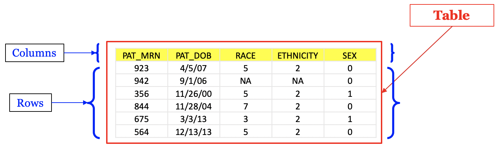

<!--
author:   Peter Camacho, Clinical Reporting Unit, Children's Hospital of Philadelphia
email:    camachop@chop.edu
version:  0.0.0
language: en
narrator: US English Female
comment:  SQL (Structured Query Language) is a domain-specific language used in programming and designed for managing data held in a Relational Database Management System (RDBMS), or for stream processing in a relational data stream management system (RDSMS).
link:     https://chop-dbhi-arcus-education-website-assets.s3.amazonaws.com/css/custom.css
logo:     https://github.com/arcus/education_fellows/raw/main/img/chop-icon.png
-->


# SQL : Structured Query Language

Overview
========

<div class = "hint">
This Training Module will provide an overview of SQL (<b>S</b>tructured <b>Q</b>uery <b>L</b>anguage).
</div>

Contents
========

* [What is SQL?](#what-is-sql)

* [Basic SQL Syntax](#Basic-SQL-Syntax)

* [Advanced SQL Syntax](#Advanced-SQL-Syntax)

* [SQL Joins](#SQL-Joins)

* [DDL - Data Definition Language](#ddl---data-definition-language)

* [DML - Data Manipulation Language](#dml---data-manipulation-language)

## What is SQL?

To put it simply, SQL (**S**tructured **Q**uery **L**anguage) is the programing language used to interact with “**Relational Databases**”.

> **Vocabulary Note**:
> 
> A **Relational Database** is a type of database that stores data in objects called Tables. Tables themselves are objects comprised of Columns and Rows (similar to data in an Excel file). 
>
> 
>
> Tables within the database are related to one another by shared columns, sometimes referred to as "join keys" (more on join keys later!).
>
> The primary benefit of the **Relational Databases** model is the ability to use these "join keys" to create complex reports combining information from multiple tables to derive meaningful information from your data (this is done using SQL!)

You can think of **SQL** as the super-secret code that you can use to “ask explicit questions” about the information in your Relational Database.

### When Should SQL Be Used?

**SQL** should be used any time you need to access data stored within a **Relational Database**.

More specifically, **SQL** is best suited for composing/structuring/formatting datasets for export and downstream analysis in programs like R or Python.

> **Historical Note**:
> 
> **SQL** was created in the early 1970's by IBM as a method for more easily accessing information from their internal database system. 
> 
> By 1979 Relational Software, Inc. (now Oracle Corporation) released the first commercially available implementation of **SQL** as a part of their Oracle V2 database application.
> 
> Today **SQL** is the most common programing language for extracting and organizing data in Relational Database Systems.

Ideally, all of your Data Transformations should be done using **SQL** in order to ensure that the final dataset exported from your queries don't require any additional major transformations before the analysis phase of your work can begin. 

The reason for this is that, especially for large datasets, **SQL** is a much more efficient tool for large-scale data transformations than your traditional scripting or analytic packages.

Additionally, making sure that all of your data transformations are done using **SQL** is an easy way to ensure greater reproducibility and standardization of your work (just be sure to save/document all of your **SQL** queries!).

### When Should SQL Not be Used?


Although **SQL** is a great tool for organizing your data into meaningful reports for data extraction, it is not a great tool to use for your actual analysis work.

Despite having many functions for text parsing, **SQL** is not the tool/language you want to use for any NLP (Natural Language Processing) work.

**SQL** also doesn’t have any capabilities to directly support Data Visualization work.

For all of these "downstream analytics" use cases, you will want to use an actual analytical programing language or tool like **R** or **Python**.

### Are all Implementations of SQL The Same?

Although all **SQL** implementations have a similar structure, and the same basic syntax, each different **SQL** database product often has its own minor variations in dialect.

Colloquially people often refer to the different **SQL** dialects as different "flavors" of **SQL**.

Some Popular "Flavors" of **SQL**:

* [**MySQL**](https://www.mysql.com/) (open source)
* [**SQLite**](https://www.sqlite.org) (open source)
* [**PostgreSQL**](https://www.postgresql.org/) (open source)
* [**Oracle**](https://www.oracle.com/database/technologies/appdev/sql.html) (proprietary)
* [**BigQuery**](https://cloud.google.com/bigquery/docs/reference/standard-sql/query-syntax) (proprietary)

The most common difference between different **SQL** "flavors" are the availability of different functions that users can use for data manipulation, as well as the types of error messages that will be returned to the user when running code with syntax issues.

That said, knowing the specific "flavor" of **SQL** your database uses is especially useful when first getting started writing queries and troubleshooting errors.

> **Important Note**:
>
>Throughout the remainder of this documentation we will be using the [**BigQuery**](https://cloud.google.com/bigquery/docs/reference/standard-sql/query-syntax) **SQL** syntax to write our code (this is the "Flavor" of **SQL** used in Arcus Labs here at CHOP).

## Basic SQL Syntax

At a high level, you’re going to have to provide three pieces of information when constructing **SQL** "**queries**":

 1. The name of the **Table(s)** where the data is stored.
 2. The **Column(s)** from the **Table(s)** you want to look at.
 3. The **filtering condition(s)** you want to apply to your data pull. 

You put these basic pieces of information together using the syntax shown below to create a **SQL** query: 

```sql
SELECT _2_ FROM _1_ WHERE _3_

```

> **Vocabulary Note**:
> 
> **Queries** are essentially questions or requests for data, written in a specific structure that your Relational Database can understand.

The sections that follow will provide an overview of this basic **SQL** syntax and go into detail on additional modifications to this basic syntax that can be used to format the output from your queries.

<hr><hr>

**SECTION CONTENTS**

* [Select Statement](#Select-Statement)

  * [Aliasing](#Aliasing)
  * [Adding Comments](#Adding-Comments)

* [Distinct Clause](#Distinct-Clause)
* [Order By Statement](#Order-By-Statement)
* [Limit Clause](#Limit-Clause)
* [Where Clause](#Where-Clause)
* [Like Operator](#Like-Operator)

### Select Statement

The **Select Statement** is used to specify which columns you would like to have returned as output from your **SQL** query.

The basic components of a **Select Statement** are the `SELECT` and `FROM` keywords. 

> The `FROM` keyword is used to specify the table you would like to use as the base of your query, and the `SELECT` keyword is used to provide a list of columns (from the table(s) referenced in your query) that you would like returned as output.

**Select All Columns**

If you would like to return ALL of the columns from the table(s) specified in your **SQL** query, you can use the `*` wild card character as shown in the example below:

```sql
select *
from arcus.patient

```

> **Additinal Info**:
> 
> Notice that the `FROM` line of this query is followed by 2 words separated by a period. 
> 
> The first word is the name of the Schema/Catalog that your data is stored in, and the second word is the name of the specific data Table you would like to reference as the base of your query.
> 
> This format is known as "**Dot Notation**".

**Select Specific Columns**

If you would only like to return a specific set of columns in your select statement you will need to explicitly list out each of those columns after the select keyword, with each separate column reference separated by a comma:

```sql
select
  patient.pat_id
  ,patient.sex
  ,patient.race
  ,patient.ethnicity
  ,patient.state_abbr
from arcus.patient

```

> **Additional Info:**
> 
> Notice that each column listed in the **Select Statement** first lists the name of the table that the column belongs to, then the name of the column itself (separated by a period). 
> 
> This is another example of the use of "**Dot Notation**" in **SQL**.
> 
> Though not required for a single table select statement, it is a good idea to follow this practice any time you are writing a select statement in order to make sure its clear which table each column is coming from. Doing this will make things less error-prone if you ever want to add additional tables to your query and will make it easier for other programmers to read your code.

### Aliasing

In SQL, it is possible to assigne a custom (or "short hand") name to a table or column in your query using a tequnique called **Aliasing**.

> **Aliasing** *Tables* can be helpful for a **SQL** programmer so that they don't have to type out the full name of a table each time they want to make reference to it. 

> **Aliasing** *Columns* can be helpful to consumers of your data by assigning clearer, more "comprehensible", names for a given column than the name that might be assgined to it in the database.

**Aliases** are assigned by placing the `as` key word directly after the item (table/column) you would like to alias, followed by the name you would like to assign as its **alias**.

In the example below, we can see **Aliasing** being used to rename the `patient` table to `p`, and renaming the `pat_id` and `state_abbr` columns to `unique_patient_id` and `state_shortname`.

```sql
select
  p.pat_id as unique_patient_id
  ,p.sex
  ,p.race
  ,p.ethnicity
  ,p.state_abbr as state_shortname
from arcus.patient as p

```

> **Note**: We will see aliasing again in a few other contexts later on in this documentation, however I wanted to be sure to make you aware of these 2 most basic/common cases of aliasing before moving fowards.

### Adding Comments

Before diving into any more explicit SQL coding, its important to understand the concept of adding "comments" to your **SQL** code.

Comments are essentially explanatory or helpful bits of text that programmers can add to their code as documentation for themselves or other reviewers of their code, and that don't actually effect the execution of the SQL code in any way.

In **SQL** there are 2 different techniques that can be used for adding comments, **single-line** and **multi-line** comments

> **Single-Line** Comments can be created by typing 2 minus signs in a row (i.e. `--`). 
> 
> Once added to your code, anything that appears to the right of the `--` comment delimiter will be treated as comment text.
> 
> **Multi-Line** Comments can be started by adding the `/*` characters to your code, and the multi-line comment can be closed by adding the `*/` characters. 
> 
> Once created, any text that appears between the `/*` and `*/` "tags" will be treated as comment text.

The code block below provides an example of each of these styles of commenting:

```sql
/* This is a simple demographics query*/
select
  patient.pat_id      --unique patient identifier.
  ,patient.sex        --patient sex {Male, Female, Unknown, null}
  ,patient.race       --patient race
  ,patient.ethnicity  --patient ethnicity {Hispanic or Latino, Not Hispanic or Latino, Refused, Unknown}
  ,patient.state_abbr --Two Character State Abbreviation.
from arcus.patient


/*
    Aren't Comments Great!
*/
```

### Distinct Clause

The `distinct`clause in **SQL** can be placed directly after the `select` key word, and can be used to limit your result set down to only the unique row values. 

> This can be especially useful when exploring a dataset for the first time and trying to become familiar with the data in each column of a given table. 

The code block below provides an example of using this syntax to invesitgate the unique combinations of values from the `sex` and `ethnicity` columns from the `patient` table; as you can see the `distinct` clause will work on any number of columns:

```sql
select distinct
  patient.sex
  ,patient.ethnicity
from arcus.patient

```

> **Pro Tip**: The `distinct` clause is especially useful for removing duplicates rows from the result set of your `SQL` queries; in the event that duplicate rows would cause errors during analysis.

### Order By Statement

Another useful peace of **SQL** syntax for exporing datasets is the `order by` statement, which (as its name suggests) is used to order your result set by a given set of columns.

When listing columns in the `order by` statment you can specify that they be sorted in either ascending (`asc`) or descending (`desc`) order. 

```sql
select distinct
  patient.sex
  ,patient.ethnicity
from arcus.patient
order by
  patient.sex asc
  ,patient.ethnicity desc

```

> **Note:** By default, all items in the `order by` clause will be sorted in `asc` order if no explicit ordering argument/type is provided.

### Limit Clause

The `limit` clause can be used to limit the result set of your select statement to (at most) a pre-defined number of rows.

> To do this all you need to do is add the word `limit` as the last line of your query, followed by the number of rows you would like your result set truncated at. 

The example below pulls all columns from the encounter table, and limits the result set to only 10 rows.

```sql
select * 
from arcus.encounter
limit 10

```

> **Tip**: As you can see, this is also a great peace of syntax to use for exporing tables you might be unfarmiliar with (in the event you want to see the kind of data a table/query contain but you don't want to wait for all rows of the query to return; which can take a long time for larger tables or more complex queries).

### Where Clause

The **Where Clause** is the section of your query used to specify any "filtering logic" that should be applied to your query before returning any output. 

The below example uses the **Where Clause** to filter output on only those records that represent the 1st encounter for each patient.

```sql
select * 
from arcus.encounter
where
  encounter.pat_encounter_num = 1
  
```

Although the above example lists only one constraint for the dataset, the **where clause** can contain any number of filtering arguments needed. 

Check out the code block below for an example of a where clause that includes multiple constraints, and makes use of both **Comparison** and **Logical** Operators. 

```sql
select * 
from arcus.encounter
where
  pat_encounter_num = 1
  and (
    appt_age = 0
    or appt_age = 1
    or appt_age = 2
  )
  
```

> **Additional Reading**:
> 
> To read more about the basic types of "Operators" avaiable for use in a **SQL** query, click [here](https://www.tutorialspoint.com/sql/sql-operators.htm) for some helpful documentation from **tutorialspoint.com**.

#### Like Operator

In the `where` clause, the `like` operator can be used to filter on row values that contain a specific "pattern of text" in a column of interest (also known as "text/pattern matching").

For the purpose of "pattern matching", the `like` operator is able to utilize the 2 distinct **Wildcard Charaters** listed below:

|Wildcard Characters|Description|
|---|---|
|`%`|"Wildcard" for 0 or more characters.|
|`_`|"Wildcard" for exactly 1 characters.|

The shown below uses the `like` opperator to filter on only those records from the `allergy` table where the `allergen_name` is starts with the text "stra".

```sql
select distinct allergy.allergen_name
from arcus.allergy
where
    upper(allergy.allergen_name) like upper('stra%')

```
> **WARNING**: 
> 
> The `like` operator (and almost everything else in **SQL**) is **CASE SENSITIVE**!
> 
> This means an upper and lower case version of the same letter will be treated differently (i.e. `'a'<>'A'`). 
> 
> For this reason I recommend that you ALWAYS use either the `lower()` or `upper()` functions, as shown above, when dealing with text/string based data in your sql queries.

## Advanced SQL Syntax


**SECTION CONTENTS**

* [Dealing with Null Values](#Dealing-with-Null-Values)
* [Case Statement](#Case-Statement)
* [Aggregate Functions](#Aggregate-Functions)

    * [Group By Statement](#Group-By-Statement)
    * [Having Clause](#Having-Clause)

* [Sub Queries](#Sub-Queries)

    * [With Statement](#With-Statement)
    * [Exists Statment](#Exists-Statment)

* [Regular Expression Functions](#Regular-Expression-Functions)

### Dealing with Null Values

Like many programing languages, **SQL** deals with "blank" values in a very specific way.

**SQL** uses the concept of `null` to represent "blank" row values.

If you ever find yourself in a situation where you need to filter on `null` values you can use the `is null` or `is not null` opperators as shown below:

```sql
select *
from arcus.allergy
where
    allergy_delete_reason_name is null --exclude any rows where the "allergy_delete_reason_name" column has data (i.e. exclude "deleted" allergies).

```

Its also worth noting that `null` values are treated very differently from actual data. To illustrate this point, we can look at the below example:

> The `where` clause of this code block is attempting to include all rows other than those where the **allergy\_delete\_reason\_name** is equal to **'Allergy Outgrown'**, however we can see that doing this also excludes any rows where the **allergy\_delete\_reason\_name** value is `null`.

```sql
select distinct
  allergy_delete_reason_name
from arcus.allergy
where
    allergy_delete_reason_name <>'Allergy Outgrown'

```
In order to make sure that records where the **allergy\_delete\_reason\_name** is `null` are also included in our output we will need to add another line to the select statement to explicitly include them, as shown below:

```sql
select distinct
  allergy_delete_reason_name
from arcus.allergy
where
    (
        allergy_delete_reason_name <>'Allergy Outgrown'
        or allergy_delete_reason_name is null
    )

```

> **IMPORTANT NOTE**: This is a very subtle distinction that can drastically alter the output of your SQL statements, especially when writing "exclusion" logic like in the example above, so its a good idea to make sure you have a firm grasp on this before moving forward.

### Case Statement

The `case` statement is used to produce conditional row-level output based on columns/rows provided as input.

> Often when creating datasets you will come across the need to define your own "custom categories/groupings" given some raw row data as input. This is where the `case` statement can come in handy!

The `case` statement has 4 main components (shown below). 

```sql
CASE                --COMPONENT 1: start tag of the case statement.
  WHEN (…) THEN (…) --COMPONENT 2: conditional when "some input" then "some output" logic.
  …
  ELSE (…)          --COMPONENT 3: declariation of default value to be returned if when/then conditions are not met.
END                 --COMPONENT 4: end tag of case statment.
```

>Its important to note that the `case`, `else`, and `end` components can only be listed once (and the `case` and `end` components must always be listed).
>
>However, you can list as many occurrences of the `when/then` component as you would like. 
>
>When multiple `when/then` components are listed, SQL will walk through each of them in the order they are listed; and will return output for the first `when` condition to be evaluated as TRUE.
>
> Finally, if no `else` clause is explicitly specified SQL imposes a condition of `else null` by default (but you'll see I included it in the example query below anyway for the sake of illustration).

The example below uses a `case` statement to create a column called **birth\_weight\_category**, which "buckets" patients birth weights into 1 of 3 categories ('Below Average', 'Average','Above Average').

```sql
select
  patient.pat_id
  ,patient.birth_weight_kg
  ,case
    when (patient.birth_weight_kg > 4.5) then 'Above Average' 
    when (patient.birth_weight_kg < 2.5) then 'Below Average'
    when (patient.birth_weight_kg between 2.5 and 4.5) then 'Average'
    else null
   end as birth_weight_category --assumes the average birth weight is between 2.5 kg and 4.5 kg
from arcus.patient

```

### Aggregate Functions

**Aggregate Functions** can be used to summarize the values for multiple rows of data in some meaningful way. 

When used by themselfs, **Aggregate Functions** will return a single value given multiple rows of input.

See the table below for a list of the most commonly used  **Aggregate Functions**:

|Function|Description|
|:---|:---|
|`count()`|Returns a Count of the number of non-null values among the column(s)/rows provided as input.|
|`sum()`|Returns the summation of all values from a column provided as input.|
|`min()`|Returns the minimum value from a column provided as input.|
|`max()`|Returns the maximum value from a column provided as input.|
|`avg()`|Returns the average of all values from a column provided as input.|

The below table utilizes each of these **Aggregate Functions** to analyse the `birth_weight_kg` column from the `patient` table:

```sql
select
    count(patient.birth_weight_kg) as pat_weight_count
    ,sum(patient.birth_weight_kg) as sum_pat_weight_kg
    ,min(patient.birth_weight_kg) as min_pat_weight_kg
    ,max(patient.birth_weight_kg) as max_pat_weight_kg
    ,avg(patient.birth_weight_kg) as avg_pat_weight_kg
from arcus.patient

```

#### Group By Statement

The `GROUP BY` statement is used to group column results into only the unique/distinct values among them, and is used in combination with [**AGGREGATE FUNCTIONS**](#Aggregate-Functions) to generate summary statistics about the larger dataset that was "grouped" (i.e. "collapsed") by the `GROUP BY` statement. 

The code block below shows an example of using the `GROUP BY` statement to summarize some simple information from the **patient** table.

```sql
select
    patient.sex
    ,count(birth_weight_kg) as pat_count
    ,min(birth_weight_kg) as min_weight
    ,max(birth_weight_kg) as max_weight
    ,avg(birth_weight_kg) as avg_weight
from arcus.patient
group by
    patient.sex

```

##### Having Clause

The `having` clause can be used to filter your result set on the value of an **Aggregate Function** (which is something you will get an error on if you try to do in the `where` clause).

> In terms of placement in your structure, the `having` clause can be placed directly after your `group by` statement, and before your `order by` statement (if listed).

The example below uses the `having` clause to filter on only those patients from the **encounter** table that have more than 5 records (i.e. encounters) listed, and then returns a list of the encounter counts for each of these patients (sorted in descending order by "encounter count").

```sql
select
  encounter.pat_id
  ,count(distinct encounter_id) as encounter_count
from arcus.encounter
group by
  encounter.pat_id
having
  count(*)>5
order by 
  encounter_count desc

```

> **Pro Tip**: 
> 
> The `having` clause is also a great tool to use for determining which columns in your tables are potential "Primary Keys" (and which are not); "primary keys" are columns that have a unique value for each row of data.
> 
> e.g. The query below shows that the **pat\_id** column from the patient table contains a unique value for each row:
> 
> `select pat_id, count(*) from arcus.patient group by pat_id having count(*)>1`

### Sub Queries

A **Sub Query** is essentially "nested" **SQL** query that is referenced inside of a larger **SQL** query.

> **Sub Queries** can appear in the `from` section of your `select` statement like a regular table and are demarcated by open and close parentheses, followed by an alias name that you would like to use to reference it later on in your query.

The example below creates a very simple subquery called **strawberry\_allergies**, which contains all records from the **allergy** table relating to patients with  "strawberry" allergies. 

It then references this table to calculate the "noted age in years" for each patient.

```sql
select
    strawberry_allergies.pat_id
    ,round(strawberry_allergies.noted_age/365.25, 2) as noted_age_years
from (
    select allergy.*
    from arcus.allergy
    where
        upper(allergy.allergen_name) like upper('strawberry%')
) as strawberry_allergies

```

#### With Statement

The **WITH** statement can be used to create a sort of "detached Sub Query" (or "Temporary Table") that will be created before your primary **SELECT** statement runs. 

The code block below provides and example of using the `with` statement to create a "temp table" that is then refrenced in the `from` clause of the main `select` statement:

```sql
with
    strawberry_allergies as (
        select allergy.*
        from arcus.allergy
        where
            upper(allergy.allergen_name) like upper('strawberry%')
    )
select distinct
    round(noted_age/365.25, 2) noted_age_years
from strawberry_allergies
order by
  noted_age_years

```

> **Pro Tip**: This approach is often use to increase code readability, but can also be used to increase query performance in certain situations.

#### Exists Statment

The `exists` statement can be used to filter your query results on data contained (or not contained) within a separate **sub query**.

The example below uses the `exist` clause to filter the patient table on only those patients that have a documented "strawberry" allergy.

```sql
select *
from arcus.patient
where
    exists( --filter on only patients that have a "strawberry" allergy.
        select 1
        from arcus.allergy
        where
            patient.pat_id = allergy.pat_id --tell the "exists()" statement to evaluate based on pat_id and values shared between the "allergy" and "patient" tables.
            and upper(allergy.allergen_name) like upper('strawberry%') --limit on only "strawberry" allergy records.
    )

```

> **Note**: As we will see after reading the section on **SQL Joins**, the exists clause is similar to an "`INNER JOIN`".

### Regular Expression Functions

A **Regular Expression Functions** are a class of function that utilize "[Regular Expression](https://en.wikipedia.org/wiki/Regular_expression)" "[Metacharacters](https://en.wikipedia.org/wiki/Regular_expression#POSIX_basic_and_extended)" to preform some kind of pattern matching on text data.

Similar to the [`like`](#Like-Operator) opperators "wildcard" charaters, **Regular Expression "[Metacharacters](https://en.wikipedia.org/wiki/Regular_expression#POSIX_basic_and_extended)"** are used in **Regular Expression Functions** to allow for more dynamic forms of text based pattern matching.

> The most common set of **Regular Expression "[Metacharacters](https://en.wikipedia.org/wiki/Regular_expression#POSIX_basic_and_extended)"** are listed below:
>
>|Metacharacter|Description|
|:---|:---|
|^|Matches the starting position within the string.|
|\$|Matches the ending position within the string.|
|.|Matches any single character (similar to the "_" character in a like statement).|
|*|Matches 0 or more occurrences of the preceding character.|
|\||This character (known as the "choice operator") can be used to delimit multiple match patterns, and will provide a match on either the expression before or the expression after it is listed in your search string.|
>
> For a full list of **Regular Expression "Metacharacters "**, follow this [link](https://en.wikipedia.org/wiki/Regular_expression#POSIX_basic_and_extended).

The example below uses the BigQuery SQL `regexp_contains()` function to filter on records where the **allergen\_name** either *starts* with "stra" or *ends* with "egg".

> **WARNING**: In BigQuery **SQL** regular expression functions are "**Case Sensitive**".
>
> 
> This means an upper and lower case version of the same letter will be treated differently (i.e. `'a'<>'A'`). 
> 
> For this reason I recommend that you ALWAYS use either the `lower()` or `upper()` functions, as shown below, when dealing with text/string based data in your sql queries.

```sql
select distinct allergy.allergen_name
from arcus.allergy
where
    regexp_contains(
        lower(allergy.allergen_name)
        ,lower('^stra|egg$')
    )
order by
    allergy.allergen_name
    
```
As you can see from even just this simple example, regular expression functions can be much more useful/dynamic than the [`like`](#Like-Operator) for filtering on text based data.

> **Learning More about "Regular Expression Functions"**: 
> 
> For detailed documentation on all of the [BigQuery Regexp Functions](https://cloud.google.com/bigquery/docs/reference/standard-sql/string_functions#regexp_contains) that can be used, follow this [link](https://cloud.google.com/bigquery/docs/reference/standard-sql/string_functions#regexp_contains).

## SQL Joins

**What are SQL Joins**


**When to Use SQL Joins**


**SECTION CONTENTS**

* [Inner Join](#Inner-Join)
* [Left Join](#Left-Join)

### Inner Join

```sql
select
  patient.pat_id
  ,patient.sex
  ,patient.ethnicity
  ,patient.race
  ,allergy.allergen_name
  ,allergy.allergen_type_name
  ,allergy.reaction_name
  ,round(noted_age/365.25, 2) as noted_age_years
  ,allergy.allergy_status_name
  ,allergy.allergy_delete_reason_name
from arcus.patient
inner join arcus.allergy
    on patient.pat_id = allergy.pat_id
-- where
--   allergy.pat_id is null
```

```sql
select 
  --------------------------
  --encounter_diagnosis info
  --------------------------
  encounter_diagnosis.pat_id
  ,encounter_diagnosis.encounter_id
  ,encounter_diagnosis.dx_type
  ,encounter_diagnosis.line
  --------------------------
  --master_diagnosis info 
  --------------------------
  ,master_diagnosis.dx_name
  ,master_diagnosis.icd10_list
  ,master_diagnosis.icd9_list
from arcus.encounter_diagnosis
inner join arcus.master_diagnosis
  on encounter_diagnosis.dx_id = master_diagnosis.dx_id
order by
  encounter_diagnosis.encounter_id
  ,encounter_diagnosis.line

```

### Left Join

```sql
select
  patient.pat_id
  ,patient.sex
  ,patient.ethnicity
  ,patient.race
  ,allergy.allergen_name
  ,allergy.allergen_type_name
  ,allergy.reaction_name
  ,round(noted_age/365.25, 2) as noted_age_years
  ,allergy.allergy_status_name
  ,allergy.allergy_delete_reason_name
from arcus.patient
left join arcus.allergy
    on patient.pat_id = allergy.pat_id
-- where
--   allergy.pat_id is null

```

```sql
select distinct
  procedure_order.pat_id
  ,procedure_order_result.result_age as result_age_days
  ,procedure.proc_name
  ,procedure.proc_code
  ,procedure_order_result.result_component_name
  ,procedure_order_result.loinc_code
  ,procedure_order_result.line
  ,procedure_order_result.value_number
  ,procedure_order.abnormal_yn
  ,procedure_order_result.abnormal_status_name
  ,procedure_order_result.ref_low
  ,procedure_order_result.ref_high
  ,procedure_order_result.ref_range
  ,procedure_order_result.ref_unit
  --------------------------------------------
  --More General Status info.
  --------------------------------------------
  ,procedure_order.proc_ord_type_name --used to flag labs vs imaging, etc.
  ,procedure_order.proc_ord_status_name
  ,procedure_order.proc_lab_status_name
  ,procedure_order.proc_ord_class_name
  ,procedure_order.proc_ord_priority_name
  ,procedure.proc_group_name
from arcus.procedure_order --this is a comment!
left join arcus.procedure
  on procedure_order.proc_id = procedure.proc_id
left join arcus.procedure_order_result
  on procedure_order.proc_ord_id = procedure_order_result.proc_ord_id
where
  upper(procedure_order.proc_ord_type_name)=upper('Lab')

```

## DDL - Data Definition Language
> **NOTE**: Up until now all of the code we have looked at have been examples of **DQL** (Data Query Language).

### Create Table
### Create View
### Dropping Tables/Views
### Granting Access to Tables/Views
### Altering Tables/Views
#### Renaming Tables
#### Adding Columns
#### Recasting Columns


## DML - Data Manipulation Language
### Update Statment
### Insert Statment
### Delete Statment

