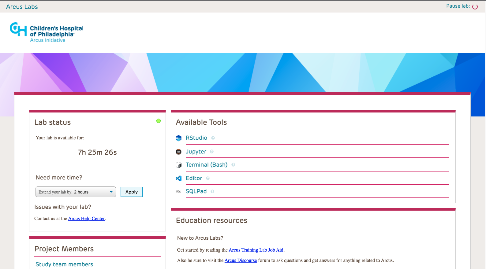
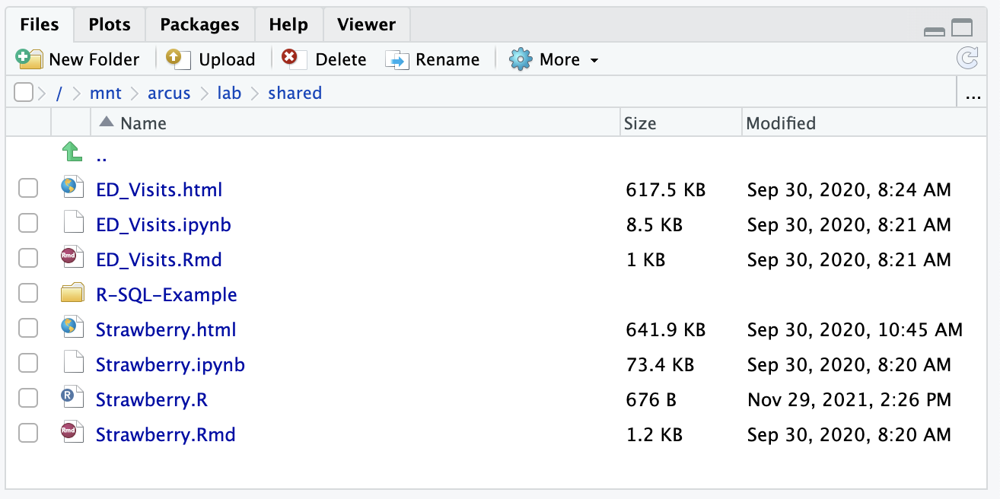
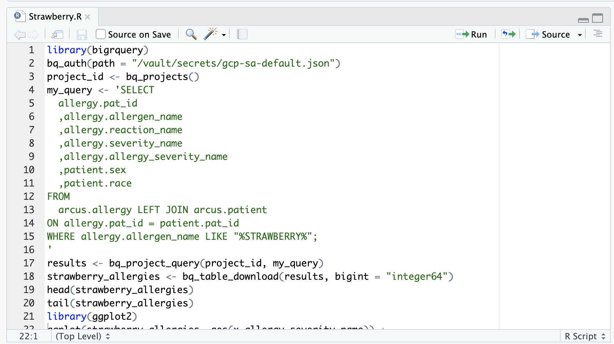

<!--
author:   Joy Payton
email:    paytonk@chop.edu
version:  1.0.1
language: en
narrator: US English Female
title: Introduction to R and RStudio
comment:  Learn to use R and RStudio in this introduction that uses an Arcus training lab.
link:     https://chop-dbhi-arcus-education-website-assets.s3.amazonaws.com/css/custom.css
logo: https://github.com/arcus/education_fellows/raw/main/img/chop-icon.png
icon: https://github.com/arcus/education_fellows/raw/main/img/favicon.ico

script:   https://code.jquery.com/jquery-3.6.0.slim.min.js

@gifPreload
<script>
(function($) {

  // Get the .gif images from the "data-alt".
	var getGif = function() {
		var gif = [];
		$('img').each(function() {
			var data = $(this).data('alt');
			gif.push(data);
		});
		return gif;
	}

	var gif = getGif();

	// Preload all the gif images.
	var image = [];

	$.each(gif, function(index) {
		image[index]     = new Image();
		image[index].src = gif[index];
	});

	// Change the image to .gif when clicked and vice versa.
	$('figure').on('click', function() {

		var $this   = $(this),
				$index  = $this.index(),

				$img    = $this.children('img'),
				$imgSrc = $img.attr('src'),
				$imgAlt = $img.attr('data-alt'),
				$imgExt = $imgAlt.split('.');

		if($imgExt[1] === 'gif') {
			$img.attr('src', $img.data('alt')).attr('data-alt', $imgSrc);
		} else {
			$img.attr('src', $imgAlt).attr('data-alt', $img.data('alt'));
		}

		// Add play class to help with the styling.
		$this.toggleClass('play');

	});

})(jQuery);
</script>
@end

-->
# Introduction to R and RStudio

<div class = "overview">

## Overview

This module provides learners with an approachable introduction to the R language and the RStudio IDE, including hands-on practice appropriate for someone who has never used R or RStudio.

### Is this module right for me?

If you're interested in working with data (that could be many things, such as bringing data into your system, cleaning and reshaping data, making statistical discoveries, creating graphs and figures, or many other types of work) and you want to try using a programming language, R is a good place to start.   This will also be a good course for you if you are joining a team or project where R is used.

### Details

**Estimated time to completion**: 1 hour

**Pre-requisites**: It is helpful if learners have used data in a tabular (table-shaped) format, with rows and columns.  Examples of this kind of data include comma separated values files (.csv) and spreadsheets (for example, Microsoft Excel).  Learners do *not* need to have access to R or RStudio on their own computers.  

**Format**: This module uses text, still images, hands-on activities, and video.  Audio is optional.

**Learning Objectives**:  After completion of this module, learners will be able to:

* Describe what R is and what RStudio is
* Execute given R code within RStudio
* Explain what a data frame is
* Use the Environment tab within RStudio to examine a data frame

</div>

## Lesson Preparation

If you intend to do the hands on activity in this module, we have a bit of preparation for you to do now.  Please log in to the clinical informatics fellows training lab at https://train-268.lab.arcus.chop.edu/ . You'll need to be on the CHOP network for this to work, and we strongly suggest using the Chrome browser.

An Arcus Training Lab holds real, deidentified data for around 300k CHOP patients, taken from Epic's Clarity reporting database and reshaped into what we call the "Arcus Data Repository" schema.  This is a bit different than the CDW and we'll go over some of the differences and why they exist in the "Arcus" module later on.

The Arcus training lab has a number of tools you can use to work with the data contained in the lab.  The mental model is a "clean room" -- all work takes place in the lab, and individual-level data cannot be taken out of the lab (as per the terms of use you all signed).  When not in use, the Arcus lab shuts down to save money, so you'll probably need to click to "resume your lab".  Go ahead and do that now!




## What is R?

R is a statistical programming language.  As a programming language, R requires that you write **code** that instructs a computer in what to do.  It's not point-and-click software like Excel or SPSS.

R code looks something like this. Note that this is code that uses external data from the University of California, Irvine.  This is example code, the output of which I can share publicly, unlike the output of data from the Arcus Training Lab.  We won't actually use this code in our hands-on work.

Can't see the entire line of code?  You should be able to scroll over using mouse or keyboard.

```r

library(tidyverse)
breast_cancer_data <- read_csv("https://archive.ics.uci.edu/ml/machine-learning-databases/00451/dataR2.csv")
hist(breast_cancer_data$Resistin)
summary(breast_cancer_data$HOMA)

```

Ideally, R code includes helpful hints along the way to help readers understand what's happening.  We can do that using **comments**, which are lines that the computer knows to ignore and not treat as code.

For example, the following may be a bit easier to understand, even if you are brand new to R.

<div class = "question" style = "min-height: 8rem;">
What distinguishes a comment from code in the sample below?</div>

```r

# tidyverse has helpful functions we'll use throughout the analysis

library(tidyverse)

# bring in the data from UCI.

breast_cancer_data <- read_csv("https://archive.ics.uci.edu/ml/machine-learning-databases/00451/dataR2.csv")

# Create a histogram of resistin values

hist(breast_cancer_data$Resistin)

# Show quartiles / mean of HOMA values

summary(breast_cancer_data$HOMA)

```

You can write R code and execute it in many ways, including using the command line, the R console, and in a Jupyter notebook.  Here, however, we're going to concentrate on using RStudio.  This tool is already installed in your Arcus Training Lab.

## What is RStudio?

RStudio is an **IDE**, or **Integrated Development Environment**, which pulls together (integrates) useful tools like help files, image viewers,  data previews, and version control for people writing (developing) code, and it puts all these tools together in a visually pleasing and helpful environment.  It's an add-on tool that makes working with R easier because it gives extra help and context.

RStudio is like R in that it's free (at least, the desktop community version of RStudio is free), but unlike R in its ownership.  While changes and updates to R are handled by the non-profit R Consortium, RStudio is a company with various products.  RStudio (the software) provides a number of additional bells and whistles for users of R, and RStudio (the company) is very influential in the R community... but RStudio doesn't "own" R.

<div class = "question">

Which of these correctly describes the relationship between R and RStudio?

[[ ]] R is a free, open source language used for data analysis, while RStudio is a related language that costs money but comes with a support agreement
[[X]] R is a free, open source language used for data analysis, and RStudio is software that makes R easier to use by adding tools and scaffolding
[[ ]] R is a mathematical and statistical system of notation, and RStudio is a free, open source language used for data analysis that uses R for statistics
[[ ]] R is a mathematical and statistical system of notation, and RStudio converts software like Stata or SPSS to use R as the underlying paradigm

<div class = "answer">
<details><summary>Click to see an explanation of the answer.</summary>

R is a language that was specifically designed for the statistical analysis of data.  It's free and open source, and while you can use it alone, it's much easier to use RStudio software to help you write R code more quickly.  RStudio also comes with additional bells and whistles that will help you create documentation of your data analysis and statistical thinking.
</details>
</div>
</div>

### Without RStudio

We could (but shouldn't) run the code sample above in a simple **R console**, which is what you get when you install R by itself on your own computer without using RStudio.  

Note that we don't include the R Console / R app in the tool kit supplied by the Arcus Training Lab.  Still, because you might have the R console (or "R app") installed on your own computer, it's worth touching on briefly.  

Using this application isn't the most user friendly experience! In the screen recording shown below, we are **not** using RStudio, but rather the R Console.  Again, the code we're running here is not code that we'll use in our hands-on work, but you can certainly use this code if you have R installed on a local computer.

<div style="display:none">@gifPreload</div>

<figure>
  
<figcaption>Click on the image to play the demo.</figcaption>
</figure>

Above, you can see that the R console had to open a new program (in a Mac, it's the Quartz viewer) to display the histogram.  You can't tell much about the `breast_cancer_data` datset and you don't get tips and support around using R.  For example, here are some questions you may have after watching the animation above.

* What does my data look like?  How can I get a sneak peek?  
* How many rows are in the data?  
* How can I get more information on how to use the `hist` command?
* How can I save my work for later re-use and expansion?

Using the R.app, also known as the R console tool, means very basic, bare-bones support for you as someone who is trying to write code.  That's why we strongly suggest using RStudio, which is a separate install, but well worth the slight additional effort.

### With RStudio

On the other hand, you could run the same code in RStudio and see something like this:

<div style="display:none">@gifPreload</div>

<figure>
  
<figcaption>Click on the image to play the demo.</figcaption>
</figure>

Using RStudio, you:

* Can easily create a **script** to save your code for reuse later (it's currently "Untitled1")
* Get a sneak peek at the data to help you to decide what to do next (here we have 116 rows of 10 columns)
* See the plot in the same application window as everything else
* Can use other helpful tools, like
  - File browser
  - Help tab
  - History of commands you've run recently
  - Operating system terminal
  - And much more!  

RStudio is the preferred method for most uses of R, and it's generally what we use to teach.  We will only scratch the surface of this tool in this module, and we'll take our next session to talk about R Markdown in depth.  

## Why Use R and RStudio?

Fine, you now know a bit more about R and RStudio, but why does this matter?  You may already know how to conduct statistical data analysis in tools like SPSS, Excel, or other software.  Why, then, learn R?  Is R only for professional data scientists?

R and RStudio are great tools for professional data scientists, but they are also increasingly part of the research tool kit, much like other lab equipment that researchers have to learn to use.  This is because the **reproducibility crisis** of studies that cannot be reproduced or fail to reproduce can be ameliorated in part by the use of scripted data analysis.

R and other free, open source, and scripted (code-based) methods of data analysis are widely considered more reproducible because:

* Anyone can obtain the software needed to use R scripts, with no license cost.
* Operations you perform to data are recorded in a script, which means they are not lost to history in the same way you might forget to precisely record a step you took in, say, Excel.
* Scripted languages can do multiple stages of data analysis in a single tool, such as downloading data, cleaning and reshaping data, performing statistical tests, displaying data visualizations, and more.  

There are many reasons why the research community is pivoting to languages like R.  While learning a new technical skill can be time consuming, working with R will pay off in the long run, because it makes it easier for you to re-run your analyses, describe your methods precisely, share your work with colleagues, and meet the requirements of funders and publications when it comes to reproducible research.

Want to hear more?  Watch around 4 minutes of one of our optional additional resources:

- [Researchers: Why R?](https://www.youtube.com/watch?v=Ids4FO5nTBE&t=07m19s) (section of interest is around 4 minutes).  This is a clip from a longer presentation given to learners at the Children's Hospital of Philadelphia.

## Starting RStudio

In your Training Lab, RStudio is an installed tool that you can reach by clicking on the "RStudio" text in your tools pane (if you're in the dashboard) or via the "burger" menu (☰) in the upper left, if you're out of the dashboard and in a different part of your lab.  If you've only just fired up your lab after it's been at rest, give a couple of minutes for the tools to all load.  You may get a transient error about the tool not being ready while your lab is still booting up.

Once you click and your RStudio tool has loaded, you will be able to see something like the following:


<div class = "question">
Take a look around your own lab and RStudio tool.  

* What do you see?  
* How would you describe the layout of panes and tabs to another person?  
* What do you think the different parts do?  
* How does what you see differ from the image above?
</div>

Have extra time?  By yourself? Try describing RStudio's appearance out loud to yourself (or your cats, or [your rubber duck](https://en.wikipedia.org/wiki/Rubber_duck_debugging)).  This may seem silly, but it is another way to consolidate your learning.

## Using a File

Before you are ready to write your own code, you might find it useful to work with an existing file.

There are several ways to write R code using RStudio.  We'll start with an R **script**.  An R script is a file that includes all the R code and any comments that you want to save in a file so you don't lose track of a process.  

For example, let's say that we know we'll want to work on some data stored in a .csv file, and it will take us several days or weeks to slowly write the code.  We can use an R script to store what we've figured out so far.  

Keeping this script means that in a few months, after having forgotten what we did, all the instructions and code for how to analyze our data are still together in a single file we can run again on our updated data.

<div class = "hint">

Pro tip:  You'll recognize an R script because it ends in `.R`!

</div>

In the lower right of your RStudio window, you should see a pane that has tabs marked "Files", "Plots", "Packages", "Help", and "Viewer".  Click on the "Files" tab, and (if you're in Chrome...) you'll see, above the file and folder display, a series of "breadcrumbs" that show your current path.  You probably see something like `/ > mnt > arcus > lab > users > yourusername`.

You can navigate to a directory in your breadcrumb path by clicking on it.  You can go up one level from where you are by clicking on the up arrow with double dots (the top icon in your list of files and folders).

<div class = "hint">

In most operating systems, `.` means "the directory I'm currently in" and `..` means "the directory that contains my current directory".  

So, say I imagine my directory system like this:

```
./
├── welcome_mat.txt
├── living_room
│   ├── recliner.R
│   ├── sofa
│   │   ├── cat.py
│   │   └── dog.R
│   └── media_cabinet
│       ├── family_movie.min
│       └── apple_tv.js
└──  kitchen
    ├── counter.md
    ├── fridge
    │   ├── leftovers.R
    │   └── butter.png
    └── sink
        ├── brownie_pan.Rmd
        └── sponge.ipynb
```
For a program running in `fridge` (say, R running `leftovers.R`), the definition of `.`, or the current directory, is `fridge`.  

For a program running in `fridge` (say, R running `leftovers.R`), the definition of `..`, or the directory holding the current directory, is `kitchen`.

Let's say you need to describe how to get to the cat, from within the sink.  You could:

* describe the full pathway, starting at the root directory (`./`): `/living_room/sofa/cat.py`
* describe a relative path, from the perspective of the sink.  First you go up a level to the kitchen, using `..`, then you still can't "see" the cat so you go up one more level, to the root directory (`..`), then from there you can go into the living room, the sofa, and to the cat: `../../living_room/sofa/cat.py`

</div>

In your files pane, navigate to the `shared` folder inside `lab`.  This is the area that everyone who has access to this lab can put files that they want other people to also work with and have access to.  Once you're in the right folder, you will see something like the following (there may be more files when you look than there are in this picture):



Now, find the file titled "Strawberry.R" and click on it to open this file in RStudio.  Hopefully you see something like this:



This is R code that has been written into a file and saved as an R script.  While the code itself is adequate, this could be improved with the addition of some comments.  So that everyone can have their own copy, please "Save As" and save this file in *your* user folder (it will be named the same as your CHOP identity, so, `lastnamef`).  Let's take some time and do that now (you might have to stumble around to find your folder), and make sure everyone can save a copy in their own folder.  

Once you've saved Strawberry.R in your own folder, here's a list of to-do, hands-on work to accomplish:

* See if you can make some educated guesses as to what is happening in the script, and add some **comments**.  Don't forget to save as you go!
* Try changing the width and height of the various panes in RStudio.
* Check out the Help menu, especially "Cheatsheets".
* Click on the various tabs to see what they hold.  

### Running Code in RStudio

Use your mouse to add a cursor (be careful not to highlight text) somewhere in the first line of code (or in the first line, period -- it's okay if the first line is a comment). Then, click "Run" in the upper right corner of the Source pane.  

What do you see now in the Console (the bottom left pane)?  Remember that comments are ignored by R, so the first line of actual R code that could be run is what ends up running (or executing) in the console.

Sometimes a command may take a while to execute, and you might see a red "Stop Sign" emblem appear in the upper right of your console pane.  When you see the stop sign, you know that something is still running and you have the option of stopping it (but you don't want to, usually).

Go ahead and run the rest of the script.  You can do this by clicking "Run" for each line (it will automatically move the cursor to the next line after execution), or highlighting the entire script and hitting Run.  There is also a keyboard shortcut that allows you to quickly run the line where your cursor currently is... can you figure out what that keyboard shortcut is?

We'll pause to let everyone run the entire script, and see if there are any errors we need to resolve.

<div class = "question">

Quick refresher from our reproducibility presentation from a few weeks ago:  Which of the following are accurate descriptions of R scripts?  Check all that apply!

[[X]] R scripts allow you to capture each step you do in data ingestion, data cleaning and preparation, and statistical analysis.
[[X]] R scripts make it easier for you to re-run your analysis if more data comes in or you need to check your work.
[[ ]] R scripts allow you to avoid writing code entirely and just describe what you want to happen in regular English.  The translator engine of R converts your instructions into code.
[[X]] R scripts usually open in the upper left pane of RStudio unless you decide to rearrange the panes.
[[ ]] R scripts can only contain code, never any extra helper text that contextualize or explain the code for humans.
[[ ]] R scripts can only be created in the R app or in command line, not in RStudio.
[[?]] Hint: Three of these things are accurate descriptions!

<div class = "answer">
<details><summary>Click to see an explanation of the answer.</summary>

R scripts do in fact allow you to record not only the concrete steps you do, but also allow you to include comments that give human-readable explanations of what you're doing.  This makes it much easier for you to re-run your analysis or share your methods with others.

You do still have to learn how to write code, because there's no "magic wand" just yet that will allow you do describe what you want in English and have software translate that into R code.

R scripts work great in the RStudio software and generally will appear (once opened) in the upper left pane of RStudio.   
</details>
</div>
</div>

### Data Frames

By running this code, you have instructed the computer to read in some data from the SQL database attached to the lab -- the same database we used in the SQL session a couple of weeks ago.  We read the data into an object in your R environment, an object called a data frame.  Technically, this is a special kind of data frame called a **tibble**, but we won't talk about what makes a tibble special right now.  It's enough to remember that you can bring in data that's already in rows and columns, like a .csv or the results from a SQL query, and make it into an R data frame.

Data frames (including special kinds of data frames like tibbles) consist of data arranged into rows and columns.  The combination of rows and columns is often called a table, and you'll sometimes hear people refer to "tabular", or table shaped, data.  Data frames can look much like a spreadsheet that you might use Excel for.  Each row is an observation (in our case, a recorded strawberry allergy) and each column is a measurement (like allergen name and race).

The new data frame / tibble object, `strawberry_allergies`, appears in your "Environment" tab in the upper right pane.  You can click on the small blue icon beside the name of the object to see the structure of the data frame (column names and data types stored in the columns).

You can also click on the name of the object to open a view of the data in the Source pane.  Or, in your R code, you can do the same thing using the `View` command.

Take a look into your data frame.  Are there columns you'd like to have added?  How do you think you might do that?  Any questions about the data?  What unique values are there for, say, `reaction_name`?

<div class = "question">

Where can you find more information about your data frame?  Try figuring this out by working in RStudio and trying out the various methods!

[[X]] Use the `View` command to open a view into the data frame, like `View(my_data)`.
[[X]] In the Environment tab of the Environment/History/Connections pane (usually in the upper right), click on the blue arrow to the left of the name of the data frame to see what columns it contains.
[[ ]] Use the `Show` command to open a display of the data frame, like `Show(my_data)`
[[X]] In the Environment tab of the Environment/History/Connections pane (usually in the upper right), click on the name of the data frame to see a view into the data.
[[?]] Hint: Only one of these methods won't work!

<div class = "answer">
<details><summary>Click to see an explanation of the answer.</summary>

RStudio gives you several methods to take a peek inside your data.  You can use code, such as:

* `head(my_data)` : shows the first few rows of the data frame called `my_data`
* `tail(my_data)` : shows the last few rows of the data frame called `my_data`
* `View(my_data)` : opens a view of `my_data` that you can scroll through and search through
* `str(my_data)` : shows the structure of the data frame called `my_data`

You can also use point-and-click for viewing data, including:

* Clicking on the name of a data frame listed in the Environment tab
* Clicking on the "expand" arrow to the left of the name of a data frame listed in the environment tab

</details>
</div>
</div>


## Help

In case some of these commands don't make sense to you, try working in the "Help" tab of the Files / Plots / Packages / etc. pane (usually the lower right).  There are two search boxes.  The uppermost search box in the top right of the pane is used to search for a topic (like "bigrquery" or "library").  The one that's lower and toward the center or left is for searching for text *within* a help file (say, if you're looking for "Example" within a help article, to copy code.)

Within RStudio, click on the "Help" tab in the lower right pane.  Choose one promising help topic to click on, or search for a term or topic in the search box in the upper right of the pane.  It appears as a new tab or window in your browser.


There are two search boxes related to help.  The one on the left, just above the help text, includes the phrase "Find in Topic".  This is for searching within the help article you're looking at currently.

The other search box is in the upper right part of the pane and can be used for searching across all available help.  For example, search for "hist" in this search box.  

## History

Within RStudio, click on the "History" tab in the upper right pane.  The commands that have been executed during your current session are listed.

Choose one of the commands by clicking on it, and choose the "To Console" button.  The code should now appear in the console in the lower left pane, ready for you to hit enter and run that command anew.


## Display

Use the "Tools" menu at the top of RStudio, choose "Global Options", then  "Appearance".

Experiment with editor settings (font size and theme), and if you want to try it out, choose "Apply".

## Terminology

* code: computer instructions written with specific syntax rules: `summary(patients$age)`
* comment: text within a script that is intended for humans and will not be run by the computer: `# print summary stats here`
* data frame: data that is organized into rows (observations) and columns (measures / fields)
* FOSS (Free, Open Source Software): software that can be used free of charge and has very open intellectual property policies
* IDE (Integrated Development Environment): software that helps people who write code to do so more easily
* R: a statistical programming language
* R Console: a bare-bones desktop interface for the R language that comes when you install the R language software
* Reproducibility crisis: the problem in peer-reviewed research in which studies *cannot* be reproduced or replicated because of insufficient information, or in which studies *fail* to be reproduced or replicated because of problems in the initial research
* RStudio: a fully featured IDE that helps R users write and work with R code more easily
* script: code and comments saved in a file, useful for saving one's work

## Additional Resources

- [Researchers: Why R?](https://www.youtube.com/watch?v=Ids4FO5nTBE&t=07m19s) (stop after this section, around 4 minutes long).  This is a clip from a longer presentation given to learners at the Children's Hospital of Philadelphia.


## Feedback


In the beginning, we stated some goals.

**Learning Objectives**:  After completion of this module, learners will be able to:

* Describe what R is and what RStudio is
* Execute given R code within RStudio
* Explain what a data frame is
* Use the Environment tab within RStudio to examine a data frame

We ask you to fill out a brief (5 minutes or less) survey to let us know:

* If we achieved the learning objectives
* If the module difficulty was appropriate
* If we gave you the experience you expected

We gather this information in order to iteratively improve our work.  Thank you in advance for filling out [our brief survey](https://redcap.chop.edu/surveys/?s=KHTXCXJJ93&module_name=%22Intro+to+R+and+RStudio%22)!
